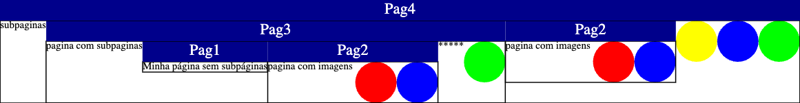

# Tópico: Expressões Aritméticas

## Exercício: Expressões Matemáticas
**ID:** Expressões Aritméticas-1
**Dificuldade:** Fácil

Crie programas em Pyret para resolver as seguintes expressões:

a) $\frac{x+2}{2}-2x$

b) $144-x^{2}+x$

c) $\sqrt{x}-2x+12$

d) $x^{3}-\frac{x}{4}+x^{-1}$

e) $2\cdot\sqrt{x+5}-26$

f) $x\cdot(x+3)-4$

### Testes
```pyret height=500
use context starter2024
```

## Exercício: Cálculo da Hipotenusa
**ID:** Expressões Aritméticas-2
**Dificuldade:** Fácil

Faça um programa que, dados os valores para os catetos de um triângulo retângulo, calcule o valor da hipotenusa. A hipotenusa é calculada pelo Teorema de Pitágoras que é dado pela expressão $a^{2}=b^{2}+c^{2}$, onde $b$ e $c$ são os catetos e $a$ a hipotenusa.

### Testes
```pyret height=500
use context starter2024
```

## Exercício: Cálculo de Cateto
**ID:** Expressões Aritméticas-3
**Dificuldade:** Fácil

Modifique o programa anterior para que calcule o valor de um dos catetos. Para isso, a função deverá receber os valores do cateto conhecido e da hipotenusa.

### Testes
```pyret height=500
use context starter2024
```

## Exercício: Conversão Fahrenheit para Celsius
**ID:** Expressões Aritméticas-4
**Dificuldade:** Fácil

Escreva um programa em Pyret para a conversão de temperatura ($^\circ$F para $^\circ$C). A expressão que calcula o valor correspondente em $^\circ$C é $C=\frac{F-32}{1,8}$.

### Testes
```pyret height=500
use context starter2024
```

## Exercício: Conversão Celsius para Fahrenheit
**ID:** Expressões Aritméticas-5
**Dificuldade:** Fácil

Similar ao exercício anterior, escreva um programa que, dado um valor de temperatura em $^\circ$C, calcule seu valor correspondente em $^\circ$F. Determine o ponto de ebulição da água em $^\circ$F (considere o ponto de ebulição da água como $100^\circ$C).

### Testes
```pyret height=500
use context starter2024
```

## Exercício: Área de Trapézio
**ID:** Expressões Aritméticas-6
**Dificuldade:** Médio

Escreva um programa em Pyret para o cálculo da área de um trapézio. Para isso, o programa deverá utilizar as variáveis base maior (B), base menor (b) e altura (h). A área de um trapézio pode ser calculada pela fórmula $A_{t}=\frac{(B+b)\cdot h}{2}$.

### Testes
```pyret height=500
use context starter2024
```

## Exercício: Raio e Circunferência
**ID:** Expressões Aritméticas-7
**Dificuldade:** Médio

Escreva uma função em Pyret que faça uso de uma variável única, composta pelo raio de uma circunferência. A função deverá retornar a soma do comprimento circunferência com sua área $(C=2\cdot r\cdot\pi \text{ e } A=\pi\cdot r^{2})$.

### Testes
```pyret height=500
use context starter2024
```

## Exercício: Volume de Cilindro
**ID:** Expressões Aritméticas-8
**Dificuldade:** Médio

Crie um programa para o cálculo do volume de um cilindro. Execute a função criada com distintos valores de raio $r\in\{1.5,2,5\}$ e altura $h\in\{12,20,32\}$.

### Testes
```pyret height=500
use context starter2024
```

## Exercício: Salário Líquido
**ID:** Expressões Aritméticas-9
**Dificuldade:** Médio

O salário líquido de uma empresa é calculado descontando do salário bruto uma determinada porcentagem referente ao imposto cobrado dos trabalhadores. O salário bruto, por sua vez, consiste na multiplicação da quantidade de horas trabalhadas pelo valor pago pela hora. Crie um programa em Pyret que compute o valor do salário líquido. Teste o programa criado para uma quantidade total de 110 horas a um valor de \$ 15.50 a hora trabalhada e 11\% de imposto.

### Testes
```pyret height=500
use context starter2024
```

## Exercício: Desconto em Loja
**ID:** Expressões Aritméticas-10
**Dificuldade:** Difícil

Uma loja de artigos variados possui uma política de cálculo para o valor a ser cobrado dos seus clientes na compra de suas mercadorias. O valor a ser pago pelo cliente é composto pelo valor unitário da mercadoria multiplicado pela quantidade a ser comprada. Usualmente, a loja oferece um desconto que é subtraído do valor a ser pago no ato da venda. O valor unitário de cada mercadoria é obtido somando o custo do bem com um valor de lucro, determinado por uma porcentagem. O desconto também é determinado por uma porcentagem que é aplicada sobre o valor total no ato da venda. Crie um programa para computar o valor final a ser pago pelo cliente em uma compra. Após criado o programa, determine qual a porcentagem máxima (considerar somente múltiplos de 5) de desconto para que o vendedor não tenha prejuízo em uma venda de 12 unidades de um artigo com custo \$ 8.40 com 33\% de lucro.

### Testes
```pyret height=500
use context starter2024
```

## Exercício: Juros Simples
**ID:** Expressões Aritméticas-11
**Dificuldade:** Difícil

Crie funções para conversão de meses em anos e vice-versa (**mes2ano** e **ano2mes**). Crie também funções para conversão de taxas de juros mensais para taxas anuais e vice-versa (**mensal2anual** e **anual2mensal**). Utilize estas funções para resolver os problemas a seguir.
    
1) Um indivíduo investiu \$ 35.000,00 em uma aplicação durante 1 semestre à taxa de juros simples de 18,68\% a.a. Em quanto o capital foi aumentado ao final do período?

2) Em um período total de 2,5 anos, um capital de \$ 12.200,00 foi aplicado à uma taxa de juros de 7,2\% a.m. Determine o montante ao final do período.

### Testes
```pyret height=500
use context starter2024
```

## Exercício: Velocidade Média
**ID:** Expressões Aritméticas-12
**Dificuldade:** Difícil

Crie um programa que determine a velocidade média de um veículo. Para isso, o usuário deverá fornecer os valores para as variáveis posição inicial e final (em quilômetros) e tempo inicial e final (em horas). A velocidade média pode ser calculada pela expressão $V=\frac{\Delta s}{\Delta t}$.

Após, modifique o programa feito para determinar a posição final de um veículo com base nas demais variáveis.

### Testes
```pyret height=500
use context starter2024
```

## Exercício: Área do Triângulo
**ID:** Expressões Aritméticas-0
**Dificuldade:** Resolvido

Crie um programa em Pyret que calcule a área de um triângulo dados sua base e altura. A fórmula da área é $A = \frac{base \cdot altura}{2}$.

### Testes
```pyret height=500
use context starter2024

fun area-triangulo(base :: Number, altura :: Number) -> Number:
  doc: "Calcula a área de um triângulo dada sua base e altura"
  (base * altura) / 2
where:
  area-triangulo(6, 4) is 12
  area-triangulo(10, 5) is 25
  area-triangulo(3, 8) is 12
end
```

# Tópico: Projeto de Algoritmos e Expressões Condicionais

## Exercício: Divisão ou Multiplicação
**ID:** Projeto de Algoritmos e Expressões Condicionais-1
**Dificuldade:** Fácil

Escreva uma função em Pyret que consome uma variável numérica. Caso o número informado seja maior que 100, ele deve ser dividido por 5, caso contrário deve ser multiplicado por 3.

### Testes
```pyret height=500
use context starter2024
```

## Exercício: Par ou Ímpar
**ID:** Projeto de Algoritmos e Expressões Condicionais-2
**Dificuldade:** Fácil

Crie um programa que, dado um número inteiro qualquer, verifique se o mesmo é par ou ímpar. No caso de ser par, o mesmo de ser dividido por 2. Caso o mesmo seja ímpar, deve ser somado a 1 e posteriormente dividido por 2. Considere utilizar a função `num-modulo(n, 2)` para verificar se um número é par ou ímpar.

### Testes
```pyret height=500
use context starter2024
```

## Exercício: Álcool ou Gasolina
**ID:** Projeto de Algoritmos e Expressões Condicionais-3
**Dificuldade:** Fácil

Um proprietário de automóvel gostaria de saber se é mais viável abastecer seu veículo com álcool ou gasolina. Ele sabe que para ser vantajoso abastecer no álcool, o preço do litro do álcool tem que custar até 70\% (inclusive) do preço do litro da gasolina. Faça um programa que consuma o preço do litro do álcool e da gasolina e informe qual é combustível mais viável financeiramente.

### Testes
```pyret height=500
use context starter2024
```

## Exercício: Calculadora Básica
**ID:** Projeto de Algoritmos e Expressões Condicionais-4
**Dificuldade:** Fácil

Desenvolva uma calculadora em Pyret para realizar as quatro operações básicas da matemática. Este programa consome uma string e dois números. A string representa o tipo da operação, e tem com possíveis valores: "adicao", "subtracao", "multiplicacao" e "divisao". De acordo com a string passada, o programa deve realizar a devida operação matemática entre os dois números. Na operação de divisão, o programa deve validar para que não ocorra divisão por zero.

### Testes
```pyret height=500
use context starter2024
```

## Exercício: Faixa Etária
**ID:** Projeto de Algoritmos e Expressões Condicionais-5
**Dificuldade:** Fácil

Escreva uma função que determine a fase da vida de um indivíduo. A função deverá consumir uma variável numérica correspondente à idade e informar a faixa na qual o indivíduo se encontra. Até 12 anos a pessoa se encontra no estágio infantil, após isso a pessoa está na juventude até os 28 anos, vida adulta até os 65 anos e terceira idade com mais de 65 anos de idade.

### Testes
```pyret height=500
use context starter2024
```

## Exercício: Situação Aluno (Média Simples e Ponderada)
**ID:** Projeto de Algoritmos e Expressões Condicionais-6
**Dificuldade:** Médio

Escreva um programa para auxílio no fechamento das médias de uma turma de alunos. Para isso, uma função deverá consumir as quatro notas do aluno, calculando sua média aritmética simples. O programa ainda deverá determinar se a situação final do aluno (reprovado se a nota for menor que 5, em exame para nota entre 5 e 7 e aprovado para nota maior ou igual a 7). Para informar a situação do aluno, retorne uma string.

Após, modifique o programa anterior para uma média ponderada. A maior nota entre as quatro notas deverá possuir um peso $4/10$, enquanto as demais possuirão peso $2/10$.

### Testes
```pyret height=500
use context starter2024
```

## Exercício: Cálculo de IMC
**ID:** Projeto de Algoritmos e Expressões Condicionais-8
**Dificuldade:** Médio

Crie um programa para cálculo do IMC (Índice de Massa Corporal). Este cálculo é determinado pela expressão $IMC=\frac{peso}{altura^{2}}$. A situação do indivíduo deve ser informada ao usuário de acordo com a tabela abaixo.

| Resultado         | Situação        |
| ----------------- | --------------- |
| Abaixo de 18      | Abaixo do peso  |
| Entre 18 e 24.99  | Peso normal     |
| Entre 25 e 29.99  | Acima do peso   |
| Acima de 30       | Obesidade       |


### Testes
```pyret height=500
use context starter2024
```

## Exercício: Multa de Velocidade
**ID:** Projeto de Algoritmos e Expressões Condicionais-9
**Dificuldade:** Médio

Crie um programa que calcule o valor de multa para um sensor de velocidade. O valor base de uma multa é estipulado em \$ 120,00. Caso o infrator ultrapassou a velocidade máxima em até $15km/h$, a multa é calculada como 88\% do valor base. Se a infração foi de $15km/h$ a $25km/h$ superior à velocidade máxima, a multa é igual a 116\% do valor base. Para um excedente entre $25km/h$ e $40km/h$, a multa é igual a 180\% do valor base. Para excedentes superiores a $40km/h$, o valor final é igual a 250\% do valor base. Dada a velocidade máxima da via e a velocidade inferida pelo sensor, informe o valor da multa (para velocidades dentro do permitido, o valor da multa é \$ 0,00).

### Testes
```pyret height=500
use context starter2024
```

## Exercício: Salto em Altura
**ID:** Projeto de Algoritmos e Expressões Condicionais-10
**Dificuldade:** Médio

Em uma competição de salto em altura, a pontuação do atleta é determinada por meio de uma expressão baseada na altura computada e no peso corporal ($Pont = \text{altura} \cdot \text{peso}$), onde a altura varia entre 1 e 2 metros e o peso entre 50 e 90kg. Escreva um programa que faça a leitura da altura computada e do peso de dois atletas (A e B) e determine qual deles é o vencedor.

### Testes
```pyret height=500
use context starter2024
```

## Exercício: Concessão de Crédito
**ID:** Projeto de Algoritmos e Expressões Condicionais-11
**Dificuldade:** Médio

Uma companhia de crediário mantém um nível de confiança sobre cada um dos seus clientes, a fim de auxiliar na concessão ou negação de crédito. Este nível varia de acordo com o tempo em que o indivíduo é cliente e sua renda mensal. O nível é determinado de acordo com a tabela a seguir.

| Tempo | Renda mensal | Nível |
|---|---|---|
| Até 1 ano | Menor que \$ 1200,00 | 1 |
| Até 1 ano | Maior ou igual a \$ 1200,00 e menor que \$ 2300,00 | 2 |
| Até 1 ano | Maior ou igual a \$ 2300,00 | 3 |
| Mais que 1 ano | Menor que \$ 1200,00 | 2 |
| Mais que 1 ano | Maior ou igual a \$ 1200,00 e menor que \$ 2300,00 | 3 |
| Mais que 1 ano | Maior ou igual a \$ 2300,00 | 3 |

Empréstimos para clientes com nível 1 não são concedidos. Clientes com nível dois são analisados por especialistas. Todos os empréstimos com nível 3 são concedidos. Escreva um programa que, dado o tempo em que o indivíduo é cliente e sua renda, determine a situação da concessão de crédito (negado, em análise ou aprovado).

### Testes
```pyret height=500
use context starter2024
```

## Exercício: Seguro de Veículo
**ID:** Projeto de Algoritmos e Expressões Condicionais-12
**Dificuldade:** Médio

Crie um programa que calcule o valor do seguro de um veículo. Caso o ano do mesmo seja anterior a 2000, o valor base do seguro é \$ 2000,00. Para veículos mais novos, o valor base cai para \$ 1200,00. Caso o proprietário tenha menos de 25 anos de idade, é acrescido \$ 800,00 no valor do seguro. Caso o veículo seja utilizado para trabalho, é acrescido um valor de \$ 650,00. O programa deverá fazer uso das variáveis necessárias e determinar o valor final do seguro.

### Testes
```pyret height=500
use context starter2024
```

## Exercício: Conceito de Aluno
**ID:** Projeto de Algoritmos e Expressões Condicionais-13
**Dificuldade:** Médio

Na disciplina de fundamentos de algoritmos, os alunos são avaliados por suas notas obtidas nas três atividades da disciplina: prova $1 (p_{1})$, prova $2 (p_{2})$ e listas de exercícios (E). A média final (M) de cada aluno é calculada através da média aritmética ponderada de suas notas obtidas nessas três atividades, sendo que as atividades valem $p_{1}=40\%$, $p_{2}=50\%$ e $E=10\%$ da média final. Para que o conceito de um aluno seja estimado, o professor precisa ainda avaliar se o aluno possui a frequência (F) mínima de participação nas aulas. A conversão da média final e frequência para o conceito é realizada da seguinte forma:
    
-  FF: $F < 75\%$;
-  D: $0 \leq M < 6.0$;
-  C: $6.0 \leq M < 7.5$;
-  B: $7.5 \leq M < 9.0$;
-  A: $9.0 \leq M$;
    
Para auxiliar o professor nesta tarefa, faça um programa em Pyret que consuma as notas de $p_{1}$, $p_{2}$, E e F e calcule o conceito do aluno. Considere o intervalo [0, 10] para cada uma das notas e [0, 100] para a frequência.

### Testes
```pyret height=500
use context starter2024
```

## Exercício: Aprovação de Aluno
**ID:** Projeto de Algoritmos e Expressões Condicionais-14
**Dificuldade:** Médio

Agora que o professor possui um programa para calcular o conceito dos alunos, ele precisa verificar se os alunos foram aprovados ou reprovados na disciplina. Para que um aluno seja aprovado ele precisa ter conceito A, B ou C, caso contrário o aluno é reprovado. O programa deve consumir a saída obtida pelo programa do exercício anterior e informar se o aluno está aprovado ou reprovado. No caso de ter sido reprovado, o sistema deve ainda informar o motivo da reprovação (nota ou frequência).

### Testes
```pyret height=500
use context starter2024
```

## Exercício: Anualidade de Seguro
**ID:** Projeto de Algoritmos e Expressões Condicionais-15
**Dificuldade:** Médio

Uma seguradora de veículos precisa de um programa de computador para facilitar o cálculo do valor da anualidade dos seguros. O valor da anualidade de um seguro é calculado com base no valor do veículo, ano de modelo e idade do condutor. O valor da anuidade do seguro de qualquer veículo se inicia com um valor base de \$ 500,00. Este valor é incrementado de acordo com as características do veículo e condutor. Inicialmente, a seguradora incrementa o valor base em função das características do veículo:
    
-  Para veículos com modelo inferior a 1995, adiciona-se 20\% do valor do veículo ao valor base.
-  Para veículos entre 1995 e 2008, o valor adicionado é de 10\% do valor do veículo.
-  Para veículos acima de 2008, o valor a ser incrementado no valor base é de 4\% do valor do veículo.
    
A partir deste novo valor obtido a seguradora insere uma taxa de risco, variável em função do perfil do condutor. A seguradora incrementa este valor em 20\% para os casos onde o condutor possui menos de 25 anos. Para os condutores com idade entre 25 e 50 anos, o valor do seguro não é incrementado. Já os condutores acima de 50 anos recebem um desconto de 10\% sobre o valor total do seguro. Desenvolva um programa que compute o valor da anualidade.

### Testes
```pyret height=500
use context starter2024
```

## Exercício: Formação de Triângulo
**ID:** Projeto de Algoritmos e Expressões Condicionais-16
**Dificuldade:** Difícil

Escreva um programa no Pyret que receba os valores de medida de três segmentos de reta. O programa deverá determinar se estas retas podem formar um triângulo. Para formar um triângulo, nenhuma de suas arestas pode ser maior que a soma das outras duas.

### Testes
```pyret height=500
use context starter2024
```

## Exercício: Desconto de Transporte
**ID:** Projeto de Algoritmos e Expressões Condicionais-17
**Dificuldade:** Difícil

Uma empresa cobra de seus funcionários uma taxa mensal referente ao traslado de suas residências até o local de trabalho. A taxa é descontada do salário conforme a distância entre a empresa e a residência do funcionário e proporcional ao valor de seu salário conforme a tabela:

| Valor do salário | Distância | Valor do desconto |
|---|---|---|
| Até \$ 2000,00 | Menor que 5km | \$ 80,00 |
| Até \$ 2000,00 | Maior ou igual a 5km e menor que 10km | \$ 120,00 |
| Até \$ 2000,00 | Maior ou igual a 10km | \$ 200,00 |
| Mais que \$ 2000,00 | Menor que 5km | \$ 110,00 |
| Mais que \$ 2000,00 | Maior ou igual a 5km e menor que 10km | \$ 160,00 |
| Mais que \$ 2000,00 | Maior ou igual a 10km | \$ 240,00 |

Crie um programa que compute o salário final do funcionário com base no valor do salário e na distância.

### Testes
```pyret height=500
use context starter2024
```

## Exercício: Pessoa Mais Velha
**ID:** Projeto de Algoritmos e Expressões Condicionais-18
**Dificuldade:** Médio

Escreva uma função que receba os nomes de duas pessoas. Além disso, a função deve consumir o ano, mês e dia de nascimento de ambos. A função deverá retornar o nome da pessoa mais velha.

### Testes
```pyret height=500
use context starter2024
```

## Exercício: Viagem e Combustível
**ID:** Projeto de Algoritmos e Expressões Condicionais-19
**Dificuldade:** Resolvido

Considere um motorista que precisa entregar mercadorias em três cidades distintas. A ordem das cidades é determinada antecipadamente. Antes de iniciar sua viagem, o motorista precisa se certificar de que possui combustível suficiente para realizar o percurso. Escreva um programa que, dadas as distâncias a serem percorridas para chegar a cada cidade, o consumo do veículo (em quilômetros por litro de combustível) e a quantidade de combustível disponível, informe quais cidades podem ser visitadas. A saída deverá ser informada ao usuário mediante as strings "Cidade 1", "Cidades 1 e 2" e "Todas as Cidades".

### Testes
```pyret height=500
use context starter2024

fun combustivel-necessario(distancia :: Number, consumo :: Number) -> Number:
  doc: "Dado a distância a ser percorrida e o consumo do veículo (em quilômetros por litro de combustível), calcula a quantidade de combustivel necessário para realizar o percurso."

  distancia / consumo
where:
  combustivel-necessario(100, 10) is 10
  combustivel-necessario(100, 20) is 5
  combustivel-necessario(100, 5) is 20
end

fun cidades-possiveis(dist1 :: Number, dist2 :: Number, dist3 :: Number, consumo :: Number, combustivel :: Number) -> String:
  doc: "Dadas as distâncias a serem percorridas para chegar a cada cidade, o consumo do veículo (em quilômetros por litro de combustível) e a quantidade de combustível disponível, informe quais cidades podem ser visitadas. A saída deverá ser informada ao usuário mediante as strings \"Cidade 1\", \"Cidades 1 e 2\" e \"Todas as Cidades\"."
  
  ask:
    | combustivel-necessario(dist1, consumo) > combustivel then: "Nenhuma cidade"
    | combustivel-necessario(dist1 + dist2, consumo) > combustivel then: "Cidade 1"
    | combustivel-necessario(dist1 + dist2 + dist3, consumo) > combustivel then: "Cidades 1 e 2"
    | otherwise: "Todas as Cidades"
  end

where:
  cidades-possiveis(100, 100, 100, 10, 10) is "Cidade 1"
  cidades-possiveis(100, 100, 100, 10, 20) is "Cidades 1 e 2"
  cidades-possiveis(100, 100, 100, 10, 30) is "Todas as Cidades"
end
```

## Exercício: Positivo, Negativo ou Zero
**ID:** Projeto de Algoritmos e Expressões Condicionais-0
**Dificuldade:** Resolvido

Escreva uma função em Pyret que receba um número e retorne a string `"positivo"`, `"negativo"` ou `"zero"` conforme o valor recebido.

### Testes
```pyret height=500
use context starter2024

fun classifica-numero(n :: Number) -> String:
  doc: "Retorna 'positivo', 'negativo' ou 'zero' dependendo do valor de n"
  if n > 0:
    "positivo"
  else if n < 0:
    "negativo"
  else:
    "zero"
  end
where:
  classifica-numero(10)  is "positivo"
  classifica-numero(-5)  is "negativo"
  classifica-numero(0)   is "zero"
end
```

# Tópico: Tabelas

## Exercício: Doces com muito açúcar (Parte 1)
**ID:** Tabelas-1
**Dificuldade:** Fácil

Vamos usar o poder das tabelas para extrair informações do nosso conjunto de dados sobre doces (já carregado no bloco de código abaixo na variável `candy-data`).

Use o código `candy-row = candy-data.row-n(0)` para obter a primeira linha de `candy-data`. Escreva uma função que calcule se a porcentagem de açúcar (`"sugar-percent"`) em uma linha é maior que 0.75.

### Testes
```pyret height=500
use context dcic2024

include gdrive-sheets

# spreadsheet id from Google Sheets
ssid = "1XzeWZToT-lqPFVpp-RZLimdoGdGaTcVQZ_8VbDbAkOc"
data-sheet = load-spreadsheet(ssid)
candy-data = 
  load-table: name, chocolate, fruity, caramel, nutty, nougat, crisped-rice, 
    hard, bar, pluribus, sugar-percent, price-percent, win-percent
    source: data-sheet.sheet-by-name("candy-data", true)
  end

first-row = candy-data.row-n(0)
fourth-row = candy-data.row-n(4)

fun is-sugar-rich(r :: Row) -> Boolean:
  doc: "Dado uma linha da tabela, verifica se a porcentagem de açúcar é maior que 0.75"
  # Complete aqui
where:
    is-sugar-rich(first-row) is false
    is-sugar-rich(fourth-row) is true    
end
```

## Exercício: Doces com muito açúcar (Parte 2)
**ID:** Tabelas-2
**Dificuldade:** Médio

Queremos saber quais doces têm mais açúcar. Escreva uma função que produza uma nova tabela contendo apenas os doces onde `"sugar-percent"` é maior que 0.75. Use a função `filter-with` e se beneficie da função implementada na parte 1.

### Testes
```pyret height=500
use context dcic2024

include gdrive-sheets

# spreadsheet id from Google Sheets
ssid = "1XzeWZToT-lqPFVpp-RZLimdoGdGaTcVQZ_8VbDbAkOc"
data-sheet = load-spreadsheet(ssid)
candy-data = 
  load-table: name, chocolate, fruity, caramel, nutty, nougat, crisped-rice, 
    hard, bar, pluribus, sugar-percent, price-percent, win-percent
    source: data-sheet.sheet-by-name("candy-data", true)
  end

fun is-sugar-rich(r :: Row) -> Boolean:
  doc: "Dado uma linha da tabela, verifica se a porcentagem de açúcar é maior que 0.75"
  # Copie de sua implementação do exercício anterior
end

fun filter-sugar-rich(table :: Table) -> Table:
    doc: "Dado uma tabela de doces, filtra os doces com porcentagem de açúcar maior que 0.75"
    # Complete aqui
end
```

## Exercício: Doces com chocolate
**ID:** Tabelas-3
**Dificuldade:** Médio

Quantos dos doces possuem chocolate? Escreva uma função que filtre os doces com o valor da coluna `"chocolate"` igual a `true` e depois descubra a quantidade total de linhas restantes utilizando a função `.length()`.

### Testes
```pyret height=500
use context dcic2024

include gdrive-sheets

# spreadsheet id from Google Sheets
ssid = "1XzeWZToT-lqPFVpp-RZLimdoGdGaTcVQZ_8VbDbAkOc"
data-sheet = load-spreadsheet(ssid)
candy-data = 
  load-table: name, chocolate, fruity, caramel, nutty, nougat, crisped-rice, 
    hard, bar, pluribus, sugar-percent, price-percent, win-percent
    source: data-sheet.sheet-by-name("candy-data", true)
  end

first-row = candy-data.row-n(0)
fourth-row = candy-data.row-n(4)

fun is-chocolate(r :: Row) -> Boolean:
    doc: "Dado uma linha da tabela, verifica se o doce possui chocolate"
    # Complete aqui
where:
    is-chocolate(first-row) is true
    is-chocolate(fourth-row) is false
end

fun count-chocolate(table :: Table) -> Number:
    # Complete aqui
where:
    count-chocolate(candy-data) is 37
end
```

# Tópico: Listas

## Exercício: Tamanho de uma lista
**ID:** Listas-1
**Dificuldade:** Fácil

Construa uma constante contendo uma lista de strings com os nomes das linguagens de programação C, C++, C#, Java, Javascript, PHP, Ruby, Perl, R, Matlab, DrRacket e Python. Considere a criação da lista usando `link` e `empty`.

Construa uma função que receba uma lista de strings e retorne a quantidade de elementos da lista.

### Testes
```pyret height=500
use context starter2024
```

## Exercício: Salários
**ID:** Listas-3
**Dificuldade:** Médio

Desenvolva um programa que consuma uma lista de salários e verifique se todos
os salários são superiores ao salário mínimo (também dado de entrada para o programa).

### Testes
```pyret height=500
use context starter2024
```

## Exercício: Inteiros zero até n
**ID:** Listas-4
**Dificuldade:** Fácil

Desenvolva a função `inteiros-n-ate-zero :: (n :: Number) -> List<Number>` que receba um número n e retorne uma lista com os inteiros de n até zero.

## Exercício: Inteiros até n
**ID:** Listas-5
**Dificuldade:** Médio

Desenvolva a função `inteiros-ate-n :: (n :: Number) -> List<Number>` que receba um número n e retorne uma lista com os inteiros de 0 até n.

### Testes
```pyret height=500
use context starter2024
```

## Exercício: Matriculado?
**ID:** Listas-6
**Dificuldade:** Fácil

Uma lista de chamadas é composta pelos nomes dos alunos de determinada turma.
Escreva uma função que, dada uma lista de chamadas e o nome de um indivíduo, verifique se o mesmo está matriculado na turma em questão.

### Testes
```pyret height=500
use context starter2024
```

## Exercício: Acessando n-ésimo elemento
**ID:** Listas-7
**Dificuldade:** Difícil

Desenvolva a função `my-get<A> :: (lst :: List<A>, n :: Number) -> A` que receba uma lista e um número n e retorne o n-ésimo elemento da lista.

### Testes
```pyret height=500
use context starter2024

fun my-get<A>(lst :: List<A>, n :: Number) -> A:
  doc: "Retorna o n-ésimo elemento de uma lista, ou lança um erro se n estiver fora do intervalo"
  cases (List) lst:
    | empty => # Complete aqui
    | link(f, r) => # Complete aqui
  end
where:
  my-get([list: 1, 2, 3], 0) is 1
  my-get([list: 1, 2, 3], 2) is 3
  my-get([list: 1, 2], 2) raises "n muito grande"
  my-get(empty, 0) raises "n muito grande"
  my-get([list: 1, 2, 3], -1) raises "argumento invalido"

  # Compare com o Pyret .get()
  my-get([list: 1, 2, 3], 2) is [list:1, 2, 3].get(2)
end
```

## Exercício: Lista de múltiplos tipos
**ID:** Listas-8
**Dificuldade:** Difícil

Considere a lista `lst = link(1, link("dois", link("três", link(4, link(6, empty)))))`, e faça o que é pedido a seguir:

(a) Desenvolva uma função para contar a quantidade de elementos na lista.
(b) Desenvolva uma função para computar a quantidade de elementos do tipo String
na lista.
(c) Desenvolva uma função para computar o somatório dos elementos do tipo Number
da lista.
(d) Desenvolva uma função que retorne uma nova lista sem elementos do tipo Number.

### Testes
```pyret height=500
use context starter2024

lst :: List<Any> = link(1, link("dois", link("três", link(4, link(6, empty)))))
```

## Exercício: Soma de uma lista
**ID:** Listas-9
**Dificuldade:** Resolvido

Desenvolva a função `soma-lista :: (lst :: List<Number>) -> Number` que receba uma lista de números e retorne a soma de todos os elementos em posições pares (contando a partir de 0), i.e., o primeiro elemento da lista, o terceiro, o quinto, etc.

### Testes
```pyret height=500
use context starter2024

fun soma-lista(lst :: List<Number>, ind-par :: Boolean) -> Number:
  doc: "Retorna a soma de todos os elementos de uma lista de números"
  cases (List) lst:
    | empty => 0
    | link(primeiro, resto) => 
        if ind-par:
          primeiro + soma-lista(resto, false)
        else:
          soma-lista(resto, true)
        end
  end
where:
  soma-lista([list: 1, 2, 3, 4, 5], true) is 9
  soma-lista([list: 10, -3, 7], true)     is 17
  soma-lista(empty, true)                 is 0
end
```

# Tópico: Dados Estruturados e Dados Condicionais

## Exercício: Estrutura Aluno Pós
**ID:** Dados Estruturados e Dados Condicionais-1
**Dificuldade:** Médio

Apresente as definições necessárias para representar a estrutura de um aluno de pós graduação. O aluno possui quatro informações principais: número de matrícula, nome do curso que está cursando, instituição de ensino, e curso de graduação cursado. Uma instituição de ensino é composta pelo seu nome e ano de fundação. Já o curso de graduação, por sua vez, possui um nome do curso e instituição de ensino.

### Testes
```pyret height=500
use context starter2024
```

## Exercício: Instâncias de Aluno Pós
**ID:** Dados Estruturados e Dados Condicionais-2
**Dificuldade:** Médio

Considere as estruturas do exercício anterior e apresente as expressões necessárias para representar os alunos de pós graduação: Marcelo, Fernando e Gabriel. O Marcelo (matrícula 00237755) cursa Doutorado em Computação na UFRGS (fundada em 1934), e é formado em Ciência da Computação na UFRGS. O Fernando (matrícula 00236578), cursa Mestrado em Computação na UFRGS, e é formado em Sistemas de Informação pela UFSM (fundada em 1960). Já o Gabriel (matrícula 512010987), cursa Mestrado em Informática na UFSM, e possui graduação Engenharia de Software pela UDESC (fundada em 1965). Considere a reutilização das estruturas geradas para as instituições de ensino.

### Testes
```pyret height=500
use context starter2024
```

## Exercício: Mesma Instituição
**ID:** Dados Estruturados e Dados Condicionais-3
**Dificuldade:** Médio

Desenvolva uma função que consuma um elemento do tipo AlunoPos, e retorne verdadeiro caso o aluno esteja cursando a pós graduação na mesma instituição de ensino em que cursou a graduação. Teste o programa nas estruturas do exercício anterior.

### Testes
```pyret height=500
use context starter2024
```

## Exercício: Locadora de Veículos
**ID:** Dados Estruturados e Dados Condicionais-4
**Dificuldade:** Médio

Uma locadora de veículos precisa de um programa para calcular o valor da diária de locação de seus veículos. A empresa dispõe de dois tipos de veículos: carros e motos. Ambos os tipos de veículos possuem os atributos em comum: ano, modelo (descrição) e valor de mercado. Os carros ainda podem possuir alguns atributos adicionais, como: ar condicionado, direção hidráulica e vidros elétricos. O valor base cobrado pela diária
é de 0.25\% do valor de mercado do veículo. Os carros ainda possuem um acréscimo de R\$ 30.00 por opcional. Já as motos, possuem apenas uma taxa fixa de seguro, no valor de R\$ 70.00, que deve ser acrecida no valor base da diária. Com base nessa descrição, faça o que é pedido:

-  Define a estrutura Veículo, com suas variantes carro e moto.
-  Crie pelo menos 3 exemplos para cada uma das estruturas definidas.
-  Crie a função calcula-diária para efetuar o cálculo da diária de locação.
-  Teste a função calcula-diária nos exemplos anteriormente desenvolvidos.

### Testes
```pyret height=500
use context starter2024
```

## Exercício: Estrutura Ponto 2D (Resolvido)
**ID:** Dados Estruturados e Dados Condicionais-0
**Dificuldade:** Resolvido

Defina uma estrutura `Ponto` que representa um ponto no plano cartesiano bidimensional com coordenadas `x` e `y`. Em seguida, escreva a função `distancia` que, dados dois pontos, calcula a distância euclidiana entre eles. A fórmula é $d = \sqrt{(x_2 - x_1)^2 + (y_2 - y_1)^2}$.

### Testes
```pyret height=500
use context starter2024

data Ponto:
  # Estrutura para representar um ponto 2D
  | ponto(x :: Number, y :: Number)
  # x é a coordenada no eixo-x e y é a coordenada no eixo-y
end

fun distancia(p1 :: Ponto, p2 :: Ponto) -> Number:
  doc: "Calcula a distância euclidiana entre dois pontos no plano"
  num-sqrt(num-expt(p2.x - p1.x, 2) + num-expt(p2.y - p1.y, 2))
where:
  distancia(ponto(0, 0), ponto(3, 4)) is 5
  distancia(ponto(1, 1), ponto(4, 5)) is 5
  distancia(ponto(0, 0), ponto(0, 0)) is 0
end
```

# Tópico: Listas de Estruturas e Alta-Ordem

## Execício: Veículos
**ID:** Listas de Estruturas e Alta-Ordem-1
**Dificuldade:** Médio
 
Um veículo é composto por um modelo, marca e ano de fabricação. Uma lista deveículos é composta por elementos do tipo veículo. Escreva uma função que receba umalista de veículos e elimine veículos fabricados antes do ano de 1990.

### Testes
```pyret height=500
use context starter2024
```

## Exercício: Veículo Mais Antigo
**ID:** Listas de Estruturas e Alta-Ordem-2
**Dificuldade:** Difícil

Desenvolva um programa que consuma uma lista de veículos (exercício anterior) e retorne o veículo mais antigo.

### Testes
```pyret height=500
use context starter2024
```

## Exercício: IMC
**ID:** Listas de Estruturas e Alta-Ordem-3
**Dificuldade:** Médio

Escreva  uma  função  que  consuma  uma  lista  de  pessoas  (altura  e  peso) e retorne uma lista de valores correspondentes ao índice de massa corpórea - IMC (IMC = $peso / altura^2$).

### Testes
```pyret height=500
use context starter2024
```

## Exercício: Televisor
**ID:** Listas de Estruturas e Alta-Ordem-4
**Dificuldade:** Médio

Uma estrutura televisor possui um tamanho, dado em polegadas e um valor. Escreva uma função que, dada uma lista de televisores, aumente em 7% o valor dos elementos com tamanho maior ou igual a 29 polegadas.

### Testes
```pyret height=500
use context starter2024
```

## Exercício: Televisor Ordenado
**ID:** Listas de Estruturas e Alta-Ordem-5
**Dificuldade:** Difícil

Escreva uma função que, dada uma lista de televisores (exercício anterior), ordene os elementos ascendentemente de acordo com o tamanho.
Para tal, leia a documentação e use a função sort-by do Pyret: https://pyret.org/docs/latest/lists.html#%28part._lists_.List_shared._methods_sort-by%29

### Testes
```pyret height=500
use context starter2024
```

## Exercício: Peso em Diferentes Planetas
**ID:** Listas de Estruturas e Alta-Ordem-6
**Dificuldade:** Fácil

Considerando que o peso é determinado pelo produto da massa e da gravidade, crie as funções peso-na-terra, peso-na-lua e peso-em-jupiter. As funções deverão calcular o respectivo peso, dadas as gravidades de 9.8 para a Terra, 1.67 para a lua e 22.9 para Júpiter. Crie uma função de alta ordem que, dada a massa de uma pessoa e a função desejada, calcule seu peso.

### Testes
```pyret height=500
use context starter2024
```

## Exercício: Seleção de Pessoas
**ID:** Listas de Estruturas e Alta-Ordem-7
**Dificuldade:** Difícil

Considere uma estrutura para armazenar dados de uma pessoa (nome, idade, peso e sexo). Crie uma função que, dadas uma função de seleção e uma lista de pessoas, retorne uma lista com as pessoas selecionadas. Por exemplo, a função de seleção pode considerar apenas pessoas do sexo feminino, ou apenas maiores de idade.

### Testes
```pyret height=500
use context starter2024
```

## Exercício: Produtos em Estoque
**ID:** Listas de Estruturas e Alta-Ordem-0
**Dificuldade:** Resolvido

Defina uma estrutura `Produto` que possui um nome (String), preço (Number) e quantidade em estoque (Number). 

a) Utilizando a função de alta-ordem `filter` para listas em conjunto com uma expressão lambda, escreva a função `produtos-em-falta` que, dada uma lista de produtos, retorna uma lista contendo apenas os produtos cuja quantidade em estoque seja zero.

b) Utilizando a função de alta-ordem `map` para listas em conjunto com uma expressão lambda, escreva a função `aumenta-preco` que, dada uma lista de produtos e um valor percentual, retorna uma lista com o preço de cada produto aumentado em tal percentual.

### Testes
```pyret height=1000
use context starter2024

data Produto:
  | produto(
      nome :: String,   # Nome do produto
      preco :: Number,  # Preço do produto
      qtd :: Number     # Quantidade em estoque
    )
end

P1 = produto("Arroz", 5.50, 10)
P2 = produto("Feijão", 8.00, 0)
P3 = produto("Macarrão", 3.20, 0)
P4 = produto("Óleo", 7.50, 5)

L1 = [list: P1, P2, P3, P4]

fun produtos-em-falta(produtos :: List<Produto>) -> List<Produto>:
  doc: "Dado uma lista de produtos, retorna apenas os produtos com quantidade em estoque igual a zero."
  
  filter(lam(p): p.qtd == 0 end, produtos)
where:
  produtos-em-falta(L1) is [list: P2, P3]
  produtos-em-falta([list: P1, P4]) is empty
  produtos-em-falta(empty) is empty
end

fun aumenta-preco(produtos :: List<Produto>, percentual :: Number) -> List<Produto>:
  doc: "Dada uma lista de produtos e um valor percentual, retorna uma lista com os produtos com o preço aumentado em tal percentual."
  
  map(lam(p): produto(p.nome, p.preco * (1 + percentual), p.qtd) end, produtos)
where:
  aumenta-preco(L1, 0.1) is [list: produto("Arroz", 6.05, 10), produto("Feijão", 8.8, 0), produto("Macarrão", 3.52, 0), produto("Óleo", 8.25, 5)]
  aumenta-preco([list: P1, P4], 0.1) is [list: produto("Arroz", 6.05, 10), produto("Óleo", 8.25, 5)]
  aumenta-preco(empty, 0.1) is empty
end

```

# Tópico: Árvores Binárias e de Pesquisa

## Exercício: Árvore Espelhada
**ID:** Árvores (Autorreferência e Referência Mútua)-1
**Dificuldade:** Médio

Escreva a função `arvore-espelhada` que cria uma imagem de espelho de uma árvore binária (AB). Dado uma determinada AB, esta função deverá gerar uma nova AB, de modo que os nós esquerda e direita de um mesmo nível da árvore sejam permutados.

### Testes
```pyret height=500
use context starter2024

data AB:
  | vazio
  | no(id :: String, nivel :: Number, esq :: AB, dir :: AB)
end

```

## Exercício: Operações sobre Árvore Binária
**ID:** Árvores (Autorreferência e Referência Mútua)-2
**Dificuldade:** Difícil

Considere a estrutura de nó utilizada no exercício anterior para construir uma árvore binária (AB). O nível de um nó representa a sua altura em relação ao nó raiz da AB (nó raiz possui nível zero). A partir desta descrição, faça o que é pedido:

(a) Desenvolva uma função para computar a altura da árvore.

(b) Desenvolva uma função para computar o nível em que se encontra o nó de menor nível que possui ambos os filhos vazios.

(c) Modifique a função do item (b) para que ela encontre o nó de maior ou menor nível que não possui filhos. Utilize função de alta ordem para que a rotina se torne genérica.

(d) Modifique o atributo `nivel` de todos os nós da árvore de modo que seus valores não correspondam com os seus reais níveis. Em seguida, crie um programa que percorra todos os nós da AB e atualize o nível em que cada nó se encontra.

### Testes
```pyret height=500
use context starter2024
```

## Exercício: Idade Média em Árvore Genealógica
**ID:** Árvores (Autorreferência e Referência Mútua)-3
**Dificuldade:** Médio

Considere uma árvore genealógica onde cada elemento (pessoa) armazena o nome, idade, sexo, seu pai e sua mãe. Crie um programa que percorra a árvore e informe a idade média dos indivíduos.

### Testes
```pyret height=500
use context starter2024
```

## Exercício: Ancestral Mulher com Mais de 40 Anos
**ID:** Árvores (Autorreferência e Referência Mútua)-4
**Dificuldade:** Fácil

Considere uma árvore genealógica onde cada elemento (pessoa) armazena o nome, idade, sexo, seu pai e sua mãe. Escreva uma função que, dada uma pessoa, verifique se algum dos seus ancestrais consiste em uma mulher com mais de 40 anos de idade.

### Testes
```pyret height=500
use context starter2024
```

## Exercício: Lista de IDs Pares em AB
**ID:** Árvores (Autorreferência e Referência Mútua)-5
**Dificuldade:** Médio

Crie uma função que receba uma AB cujo `id` dos elementos seja um número inteiro. A função deve retornar uma lista contendo todos os ids pares da árvore.

### Testes
```pyret height=500
use context starter2024
```

## Exercício: Inserção em ABP
**ID:** Árvores (Autorreferência e Referência Mútua)-6
**Dificuldade:** Difícil

Crie uma função que recebe uma Árvore Binária de Pesquisa (ABP) e os dados de um novo nó. A função deverá inserir o novo nó na respectiva posição da árvore.

### Testes
```pyret height=500
use context starter2024
```

## Exercício: Soma de IDs Maiores que N em ABP
**ID:** Árvores (Autorreferência e Referência Mútua)-7
**Dificuldade:** Médio

Desenvolva um programa que receba uma Árvore Binária de Pesquisa (ABP) e um número. A função deverá retornar a soma de todos os ids maiores que o número passado.

### Testes
```pyret height=500
use context starter2024
```

## Exercício: Descendente Mulher com Mais de 40 Anos
**ID:** Árvores (Autorreferência e Referência Mútua)-8
**Dificuldade:** Fácil

Considere uma árvore genealógica onde cada elemento (pessoa) armazena o nome, idade, sexo, seu pai e sua mãe. Escreva uma função que, dada uma pessoa, verifique se algum dos seus descendentes consiste em uma mulher com mais de 40 anos de idade.

### Testes
```pyret height=500
use context starter2024
```

## Exercício: Contar Descendentes com Mais de 30 Anos
**ID:** Árvores (Autorreferência e Referência Mútua)-9
**Dificuldade:** Médio

Crie uma função que receba uma árvore genealógica e conte quantos descendentes possuem mais de 30 anos de idade.

### Testes
```pyret height=500
use context starter2024
```

## Exercício: Atualizar Idade na Árvore Genealógica
**ID:** Árvores (Autorreferência e Referência Mútua)-10
**Dificuldade:** Resolvido

Crie uma função que, dada uma árvore genealógica, aumente a idade em 5 anos da pessoa cujo nome seja passado como parâmetro.

### Testes
```pyret height=500
use context starter2024

data Pessoa:
  | vazio
  | pessoa(
      nome :: String,   # Nome da pessoa
      idade :: Number,  # Idade da pessoa
      sexo :: String,   # Sexo da pessoa ("masculino" ou "feminino")
      pai :: Pessoa,    # Referência para o pai (ou vazio se desconhecido)
      mae :: Pessoa     # Referência para a mãe (ou vazio se desconhecido)
    )
end

FRED = pessoa("Fred", 50, "masculino", vazio, vazio)
MARY = pessoa("Mary", 48, "feminino", vazio, vazio)
JOHN = pessoa("John", 25, "masculino", FRED, MARY)

fun atualiza-idade(arvore :: Pessoa, nome :: String) -> Pessoa:
  doc: "Dada uma árvore genealógica, aumenta a idade em 5 anos da pessoa cujo nome seja passado como parâmetro."
  
  cases (Pessoa) arvore:
    | vazio => vazio
    | pessoa(n, i, s, p, m) =>
        if n == nome:
          pessoa(n, i + 5, s, atualiza-idade(p, nome), atualiza-idade(m, nome))
        else:
          pessoa(n, i, s, atualiza-idade(p, nome), atualiza-idade(m, nome))
        end
  end
where:
  atualiza-idade(JOHN, "John") is pessoa("John", 30, "masculino", FRED, MARY)
  atualiza-idade(JOHN, "Fred") is pessoa("John", 25, "masculino", pessoa("Fred", 55, "masculino", vazio, vazio), MARY)
  atualiza-idade(JOHN, "Mary") is pessoa("John", 25, "masculino", FRED, pessoa("Mary", 53, "feminino", vazio, vazio))
end

```

# Tópico: Estruturas com Recursão Mútua

## Exercício: Listar funcionários destaque
**ID:** Árvores (Autorreferência e Referência Mútua)-11
**Dificuldade:** Médio

Neste exercício vamos construir uma árvore para representar a estrutura de setores e funcionários de uma empresa. Cada nó da árvore pode ser um funcionário ou um setor, que por sua vez pode ter outros funcionários e setores. Use as definições de dados a seguir, e construa uma função que, dada uma árvore de setores e funcionários da empresa, gera uma lista com os funcionários-destaque.

### Testes
```pyret height=500
use context dcic2024

# TIPO MEMBROSSETOR:
# =================
type MembrosSetor = List<Nodo>

# TIPO NODO:
# =========
# Um Nodo pode ser um funcionário ou um setor:
data Nodo:
  | funcionario(
      nome :: String, # nome do funcionário
      anos :: Number, # número de anos na empresa
      destaque :: Boolean # funcionário tem menção de destaque?
    )
  | setor(
      nome :: String, # nome do setor
      membros :: List<MembrosSetor> # funcionários ou subsetores
    )
end
```

## Exercício: Gerar estrelas com funcionários destaque

**ID:** Árvores (Autorreferência e Referência Mútua)-12
**Dificuldade:** Difícil

Considerando as definições de dados do exercício anterior, desenvolva uma função que, dada a árvore de funcionários e setores da empresa, devolve uma imagem com os nomes dos funcionários-destaque dentro de estrelas. A estrela deve ser dourada caso o funcionário tenha mais que 10 anos de empresa, prateada caso tenha mais que 5 e bronze, caso contrário. 

**Obs:** Note que para construir esta função é interessante usar funções de alta-ordem e usar a função construída no exercício anterior.


### Testes
```pyret height=500
use context dcid2024
include image

# Sua implementação aqui
```

## Exercício: Listar imagens de uma página web
**ID:** Árvores (Autorreferência e Referência Mútua)-13
**Dificuldade:** Médio

Neste exercício vamos construir árvores para representar a estrutura de páginas web hierárquicas (sem referências cruzadas). Cada página pode conter texto (strings), imagens, ou subpáginas. Use as definições de dados a seguir, e monte uma função que, dada uma página web, devolve uma imagem contendo todas as imagens da página e suas subpáginas, lado a lado, tendo abaixo de cada imagem o nome da página na qual a imagem se encontra.

### Testes
```pyret height=500
use context dcic2024
include image

# TIPO CONTEUDO:
# =================
type Conteudo = List<StrPag>

# TIPO PAGINA:
# =========
data Pagina:
  | pagina(
      nome :: String, # nome da página
      cont :: Conteudo # conteudo da página
    )
end

# TIPO STRPAG:
# ===========
data StrPag:
  | pag(p :: Pagina) 
  | str(s :: String)
  | img(i :: Image)
end
```

## Exercício: Mostrar a estrutura da página web

**ID:** Árvores (Autorreferência e Referência Mútua)-14
**Dificuldade:** Difícil

Considerando as definições da questão anterior, gere uma imagem com o desenho de uma página web, conforme o exemplo abaixo. 

> **Dica:** Pode-se usar a função `frame` para colocar um retângulo em volta de uma imagem, e a função `image-width` para calcular a largura de uma imagem.



### Testes
```pyret height=500
use context dcic2024
include image

# Sua implementação aqui
```

# Tópico: Grafos

## Exercício: Grau de um Nodo
**ID:** Grafos-1
**Dificuldade:** Fácil

O **grau** de um nodo em um grafo não-dirigido é o número de vizinhos que ele possui (ou seja, o tamanho da sua lista de vizinhos). Implemente a função `grau-nodo` que, dados um grafo e o identificador de um nodo, retorna o grau desse nodo. Caso o nodo não exista no grafo, retorne 0.

Em seguida, implemente `nodo-maior-grau` que retorna o identificador do nodo com maior grau no grafo. Assuma que o grafo não é vazio.

### Testes
```pyret height=500
use context dcic2024

data Nodo:
    nodo(
        id :: String,
        vizinhos :: List<String>
    )
end

type Grafo = List<Nodo>

G1 :: Grafo = [list:
  nodo("A", [list: "B", "E"]),
  nodo("B", [list: "E", "F"]),
  nodo("C", [list: "D"]),
  nodo("D", empty),
  nodo("E", [list: "C", "F"]),
  nodo("F", [list: "D", "G"]),
  nodo("G", empty)]

fun grau-nodo(g :: Grafo, id :: String) -> Number:
  doc: "Retorna o grau (número de vizinhos) do nodo com identificador id no grafo g. Retorna 0 se o nodo não existir."
  cases (Grafo) g:
    | empty => 0
    | link(f, r) =>
      if f.id == id:
        f.vizinhos.length()
      else:
        grau-nodo(r, id)
      end
  end
where:
  grau-nodo(G1, "A") is 2
  grau-nodo(G1, "D") is 0
  grau-nodo(G1, "X") is 0
end

fun nodo-maior-grau(g :: Grafo) -> String:
  doc: "Retorna o identificador do nodo com maior grau no grafo g."
  # Sua implementação aqui
  ...
where:
  nodo-maior-grau(G1) is "F"
end
```

## Exercício: Grafo Conectado

**ID:** Grafos-2
**Dificuldade:** Resolvido

Dizemos que um grafo **não-dirigido** é **conectado** quando existe um caminho entre qualquer par de nodos. Implemente a função `grafo-conectado` que recebe um grafo não-dirigido e retorna `true` se ele for conectado e `false` caso contrário.

### Testes
```pyret height=500
use context dcic2024

data Nodo:
    nodo(
        id :: String,
        vizinhos :: List<String>
    )
end

type Grafo = List<Nodo>

# Grafo conectado
G :: Grafo = [list:
  nodo("A", [list: "B", "C"]),
  nodo("B", [list: "A", "C"]),
  nodo("C", [list: "B", "D"]),
  nodo("D", [list: "C"])]

# Grafo desconectado: {A,B} e {C,D} são componentes separados
G2 :: Grafo = [list:
  nodo("A", [list: "B"]),
  nodo("B", [list: "A"]),
  nodo("C", [list: "D"]),
  nodo("D", [list: "C"])]

fun vizinhos(g :: Grafo, id :: String) -> List<String>:
  cases (Grafo) g:
    | empty => empty
    | link(f, r) =>
      if f.id == id: f.vizinhos
      else: vizinhos(r, id)
      end
  end
end

fun esta-na-lista(l :: List<String>, id :: String) -> Boolean:
  cases (List) l:
    | empty => false
    | link(f, r) =>
      if f == id: true
      else: esta-na-lista(r, id)
      end
  end
end

fun ids-grafo(g :: Grafo) -> List<String>:
  doc: "Retorna a lista de identificadores de todos os nodos do grafo."
  cases (Grafo) g:
    | empty => empty
    | link(f, r) => link(f.id, ids-grafo(r))
  end
end

fun bfs(g :: Grafo, fila :: List<String>, visitados :: List<String>) -> List<String>:
  doc: "Executa BFS no grafo g a partir de uma fila, retornando a lista de nodos visitados."
  cases (List) fila:
    | empty => visitados
    | link(first, rest) =>
      if esta-na-lista(visitados, first):
        bfs(g, rest, visitados)
      else:
        bfs(g, rest + vizinhos(g, first), link(first, visitados))
      end
  end
end

fun todos-visitados(ids :: List<String>, visitados :: List<String>) -> Boolean:
  doc: "Verifica se todos os ids estão na lista de visitados."
  cases (List) ids:
    | empty => true
    | link(id, r) =>
      esta-na-lista(visitados, id) and todos-visitados(r, visitados)
  end
end

fun grafo-conectado(g :: Grafo) -> Boolean:
  doc: "Retorna true se o grafo não-dirigido g for conectado."
  ids = ids-grafo(g)
  cases (List) ids:
    | empty => true
    | link(primeiro, _) =>
      visitados = bfs(g, [list: primeiro], empty)
      todos-visitados(ids, visitados)
  end
where:
  grafo-conectado(G)  is true
  grafo-conectado(G2) is false
end
```

# Tópico: Recursão Generativa

## Exercício: Máximo Divisor Coumum (MDC)
**ID:** Recursão Generativa-1
**Dificuldade:** Resolvido

1) Desenvolva a função `mdc-e` que, dados dois números positivos maiores que zero, retorna o máximo diviso comum (MDC) entre eles. Use recursão estrutural.

2) Desenvolva a função `mdc-g` que, dados dois números positivos maiores que zero, retorna o máximo diviso comum (MDC) entre eles. Use recursão generativa, em particular, o algoritmo de Euclides: `mdc(maior, menor) = mdc(menor, num-modulo(maior, menor))`.

3) Apresente um argumento de terminação para cada um dos algoritmos dos itens anteriores.

### Testes
```pyret height=500
use context dcic2024

include timing

fun mdc-e(a :: Number, b :: Number) -> Number:
  doc: "Retorna o máximo divisor comum (MDC) entre a e b usando recursão estrutural."

  fun primeiro-divisor(i :: Number) -> Number:
  doc: "Retorna o maior número menor ou igual a i que divide a e b."
    ask:
      | i == 1 then: 1
      | (num-modulo(a, i) == 0) and (num-modulo(b, i) == 0) then: i
      | otherwise: primeiro-divisor(i - 1)
    end
  end
  
  # procura o maior divisor de a e b iniciando a busca pelo menor entre eles.
  primeiro-divisor(num-min(a, b))

where:
  mdc-e(48, 18) is 6
  mdc-e(56, 98) is 14
  mdc-e(101, 10) is 1
end
# Terminação: A função `primeiro-divisor` é chamada com um valor `i` que começa como o menor entre `a` e `b` e é decrementado a cada chamada recursiva. O valor de `i` é sempre um número inteiro positivo, e a cada chamada recursiva, `i` diminui em 1. Portanto, eventualmente, `i` chegará a 1, momento em que a função retornará 1, garantindo que a recursão termine. Segue a definição recursiva dos números inteiros até chegar ao caso base.

fun mdc-g(a :: Number, b :: Number) -> Number:
  doc: "Retorna o máximo divisor comum (MDC) entre a e b usando recursão generativa (algoritmo de Euclides)."
  
  fun euclides(maior :: Number, menor :: Number) -> Number:
    doc: "Retorna o MDC entre maior e menor usando o algoritmo de Euclides."
    if menor == 0:
      maior
    else:
      euclides(menor, num-modulo(maior, menor))
    end
  end

  euclides(num-max(a, b), num-min(a, b))
where:
  mdc-g(48, 18) is 6
  mdc-g(56, 98) is 14
  mdc-g(101, 10) is 1
end
# Terminação: A cada chamada recursiva da função `euclides`, o segundo argumento (menor) é substituído pelo resultado de `num-modulo(maior, menor)`, que é sempre um número menor que `menor`. Portanto, a sequência de chamadas recursivas gera uma série de números cada vez menores, e eventualmente, o segundo argumento se tornará zero. Quando isso acontecer, a função retornará o valor do primeiro argumento (maior), que é o MDC. Assim, a recursão termina quando o segundo argumento atinge zero, garantindo que o processo não seja infinito.

# Tempo em milisegundos para calcular o MDC de 101135853 e 123456 usando os dois algoritmos:
time-only({(): mdc-e(101135853, 123456)})
time-only({(): mdc-g(101135853, 123456)})

```