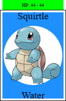
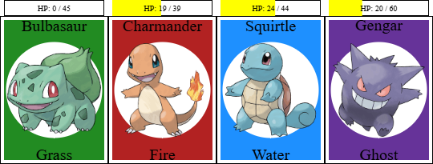

# Laboratório 3

## 🎯 Contexto e Objetivos

Neste laboratório, vamos usar **estruturas** para modelar Pokémons e seus movimentos.

<br>

Este laboratório usa uma **biblioteca** (`pokemon-lib3.arr`) que fornece funções e definições de dados que serão usadas nos exercícios a seguir. Ela é importada no template com o seguinte comando:

```
include url("https://lucasalegre.github.io/pensamento-computacional/src/data/labs/pokemon-lib3.arr")
```

Leia o arquivo `pokemon-lib3.arr` (ao final desta página) para entender as funções, tipos de dados e constantes já disponíveis que você poderá reutilizar.

Seu objetivo neste laboratório é criar a representação dos Pokémons por meio de definições de dados (estruturas) e implementar as funções de batalha que afetam os pontos de vida (HP) de um Pokémon e de todo o seu time.

> 💡 **INSTRUÇÕES PARA O LABORATÓRIO:**
> - Siga as dicas de estilo de código do Pyret: https://lucasalegre.github.io/pensamento-computacional/topics/style-guide
> - Use os nomes de funções e dados (`data`) definidos nas questões.
> - DEVE ser colocada a documentação completa, ou seja, contrato, objetivo, e pelo menos 2 exemplos/testes (cláusula `where:`).
> - Em todos os condicionais (`ask`, `cases`, `if`) coloque um comentário explicando cada caso.

## Template

Copie o template para o seu ambiente de desenvolvimento (code.pyret.org ou VS Code). Não esqueça de salvar o seu arquivo!

```pyret
file: src/data/labs/lab3-template.arr
```

---

## 📋 Exercício 1: Estrutura: Pokémons e Movimentos

1. Defina um tipo de dado estruturado `Pokemon`. Um Pokémon deve conter os seguintes campos:
   - `nome` (`String`): O nome do pokemon.
   - `id` (`Number`): O identificador do pokemon.
   - `tipo` (`TipoPokemon`): O tipo do pokemon (ex: `FIRE`, `WATER`). Repare que `TipoPokemon` é um tipo definido na biblioteca. 
   - `hp` (`Number`): Quantidade de pontos de vida atual do pokemon.
   - `max-hp` (`Number`): Quantidade máxima de pontos de vida do pokemon.

2. Crie 5 constantes correspondentes a Pokémons (ex: `BULBASAUR`, `CHARMANDER`, `SQUIRTLE`, `MEWTWO` e `PSYDUCK`), usando o construtor `pokemon(...)`. Use os valores da tabela `POKE-DATA` como referência.

3. Defina um tipo de dado `Movimento`. Um movimento pode ser de dois tipos (variantes do `data`):
   - `ataque`: com `nome` (`String`), `tipo` (`TipoPokemon`) e `poder/dano` (`Number`).
   - `cura`: com `nome` (`String`) e `cura` (`Number` - pontos de vida curados).

4. Crie 3 constantes de `Movimento`. Exemplos:
   - `EMBER`: Um ataque do tipo `FIRE` com 40 de poder.
   - `TACKLE`: Um ataque `NORMAL` com 40 de poder.
   - `SLEEP`: Uma cura com 50 de pontos de hp curados.


5. Após, gere uma imagem de cada pokemon criado no item 2, usando a função `desenha-pokemon` já disponível no template. A imagem se parecerá como a imagem abaixo:



---

## 👥 Exercício 2: Time Pokémon

Vamos representar um **time** de Pokémons como uma **lista**.


1. Defina um tipo de dado chamado `Time`, que deve ser representado como uma lista de Pokemons.
2. Usando os Pokémons criados no exercício 1, construa duas constantes do tipo `Time`.

---

## 🧪 Exercício 3: Extraindo Times de Pokémons da Tabela

Na biblioteca, a tabela `POKE-DATA` contém todos os atributos necessário para definirmos constantes do tipo `Pokemon`. Vamos gerar essas constantes de forma automática:

1. Implemente a função `extrai-pokemon-tabela(id :: Number, table :: Table) -> Pokemon`. Ela lê uma tabela em busca de um Pokémon (`id`) e devolve uma estrutura `pokemon` com seus atributos da tabela. Assuma que no instante da construção, a vida inicial (`hp`) deve ser carregada com o limite contido na tabela (da coluna `"hp"`), preenchendo tanto o `hp` quanto o `max-hp` com o seu limite total.

2. Implemente a função `cria-time(tabela :: Table, lista-ids :: List<Number>) -> Time`. Ela recebe uma lista de números que contém os IDs dos pokémons (`lista-ids`) e constrói um time contendo os Pokémons cujos indentificadores estão na lista.

---

## ❤️ Exercício 4: Atualizando o HP de um Pokemon

Para batalhar, precisamos alterar os pontos de vida (HP) dos Pokémons.

1. Implemente a função `atualiza-hp` que, dado um `Pokemon` e um valor de dano ou cura, retorna o Pokemon com HP (pontos de vida) atualizado. O valor deve ser interpretado como dano caso negativo, e cura caso positivo.
2. Os limites são importantes: O `hp` nunca pode ser menor que `0` e nem maior que o atributo `max-hp` do Pokemon.

---

## ⚔️ Exercício 5: Ataques entre Pokémons

O dano causado por um `Movimento` depende do poder do ataque e do efeito entre o tipo do movimento e o tipo do Pokémon. Use a função auxiliar `verifica-efeito(tipo-ataque, tipo-defesa)` introduzida na biblioteca deste laboratório (`pokemon-lib3.arr`) para obter tal efeito.

1. Implemente a função `aplica-movimento` que, dado um Pokemon e um Movimento, deve retornar um novo Pokemon com o HP atualizado. 
   - Para um ataque: Reduz o HP do pokemon com base no poder do ataque e no efeito entre o tipo do movimento e o tipo do pokemon defensor. Se o efeito for `EFEITO-SUPEREFETIVO`, o dano é duplicado (x2). Se for `EFEITO-NAOEFETIVO`, o dano é reduzido pela metade (*0.5). Se for `EFEITO-SEM-EFEITO`, o dano é zero. Caso contrário, o dano é aplicado normalmente.
   Faça uso de funções auxiliares para calcular o multiplicador!

   - Para cura: Atualiza o HP do pokemon com o valor de cura do movimento.


> 💡 **Lembrete:** Use a função auxiliar `verifica-efeito(tipo-ataque, tipo-defesa)` introduzida na biblioteca deste laboratório (`pokemon-lib3.arr`) para obter o efeito dado um tipo de ataque e o tipo do pokemon defensor.

---

## 🔥 Exercício 6: Aplicando um Movimento a um Time


1. Implemente a função `aplica-movimento-no-time` que, dados um `Time` e um `Movimento`, retorna um novo `Time`, onde cada Pokémon neste time deve ser atualizado com base no resultado do movimento.

Abaixo, veja um exemplo da aplicação do movimento `ataque("Ember", FIRE, 40)` em um time de 4 Pokemons:



---

## pokemon-lib3.arr

Biblioteca de Pokémon importada para o Laboratório 3.

```pyret
file: src/data/labs/pokemon-lib3.arr
```
