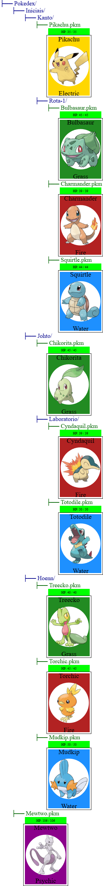

# Laboratório 5

## 🎯 Contexto e Objetivos

Neste laboratório, vamos trabalhar com **estruturas com recursão mútua**. 
Em particular, iremos modelar um sistema de arquivos, onde um **nodo** pode ser um arquivo (com um Pokémon dentro) ou um **diretório** (que contém outros nodos, podendo inclusive ter subdiretórios).

<br>

Esse modelo é chamado de **árvore** em computação, e é amplamente usado no dia a dia: o seu computador organiza todos os seus arquivos exatamente assim!
Vamos usar o universo de [Pokémon](https://pt.wikipedia.org/wiki/Pok%C3%A9mon) para tornar isso mais concreto — cada arquivo da nossa Pokédex contém um Pokémon.

<br>

Este laboratório usa a mesma **biblioteca** do Lab 4 (`pokemon-lib4.arr`), importada com:

```
include url("https://lucasalegre.github.io/pensamento-computacional/src/data/labs/pokemon-lib4.arr")
```

Leia o arquivo `pokemon-lib4.arr` (ao final desta página) para entender as funções, tipos de dados e constantes já disponíveis.

> 💡 **INSTRUÇÕES PARA O LABORATÓRIO:**
> - Siga as dicas de estilo de código do Pyret: https://lucasalegre.github.io/pensamento-computacional/topics/style-guide
> - Use os nomes de funções e dados (`data`) definidos nas questões.
> - DEVE ser colocada a documentação completa, ou seja, contrato, objetivo, e pelo menos 2 exemplos/testes (cláusula `where:`). Só não precisa incluir testes nas funções que geram imagens.
> - Em todos os condicionais (`ask`, `cases`, `if`) coloque um comentário explicando cada caso.

## Template

Copie o template para o seu ambiente de desenvolvimento (code.pyret.org ou VS Code). Não esqueça de salvar o seu arquivo!

```pyret
file: src/data/labs/lab5-template.arr
```

---

## 📁 Exercício 0: Definição de Dados

Neste laboratório vamos modelar um sistema de arquivos. Um **nodo** num diretório pode ser:

- Um **arquivo** contendo um Pokémon (com nome e o próprio Pokémon).
- Um **diretório** contendo um nome e uma lista de outros nodos (o seu **conteúdo**).

O conteúdo de um diretório é uma lista de nodos, e como um nodo pode ser um diretório, a estrutura é **recursiva**.

As definições de dados e constantes já estão prontas no template. Leia e entenda cada parte:

- O tipo de dado `Nodo` tem duas variantes:
  - `arquivo`, com campos `nome :: String` e `pokemon :: Pokemon`.
  - `diretorio`, com campos `nome :: String` e `conteudo :: Conteudo`.

- `Conteudo` é um apelido (type alias) para `List<Nodo>`.

- As constantes `P-BULBASAUR`, `P-CHARMANDER`, etc. representam os Pokémon iniciais das três primeiras gerações, obtidos com `extrai-pokemon-tabela`.

- `MINHA-POKEDEX` é uma constante do tipo `Nodo` que representa uma Pokédex de exemplo, com um diretório "Pokedex" contendo um subdiretório chamado "Iniciais" com os arquivos dos Pokémon iniciais. Note que um diretório pode conter tanto arquivos quanto outros diretórios.

> 💡 **Não é necessário escrever código neste exercício.** Certifique-se de entender a estrutura antes de prosseguir para os próximos exercícios.

---

## 🔍 Exercício 1: Busca de Arquivos e Diretórios

Vamos implementar funções para verificar se um arquivo ou diretório existe na Pokédex.

1. Implemente a função `encontra-no-nivel(conteudo :: Conteudo, nome :: String) -> Boolean` que, dados o conteúdo de um diretório e um nome, verifica se existe um nodo com esse nome **no nível imediato** — **sem entrar em subdiretórios**.

2. Implemente a função `encontra-no-nodo(nodo :: Nodo, nome :: String) -> Boolean` que, dado um nodo e um nome:
   - Se o nodo for um **arquivo**, verifica se é o arquivo procurado.
   - Se for um **diretório**, verifica se é o diretório procurado **ou** se o nome existe em algum lugar dentro dele (em qualquer profundidade).

3. Implemente a função `encontra-no-conteudo(conteudo :: Conteudo, nome :: String) -> Boolean` que, dado um conteúdo e um nome, verifica se existe um nodo com esse nome em qualquer nível — percorrendo subdiretórios recursivamente.

> 🛠️ **Dica:** As duas funções são mutuamente recursivas: `encontra-no-nodo` chama `encontra-no-conteudo`, que chama `encontra-no-nodo`. Implemente-as nessa ordem e reutilize-as entre si.

---

## 🔢 Exercício 2: Contagem de Arquivos

Vamos contar quantos **arquivos** existem num nodo, considerando todos os subdiretórios.

1. Implemente a função `conta-arquivos-no-nodo(nodo :: Nodo) -> Number` que:
   - Se o nodo for um **arquivo**, conta `1`.
   - Se for um **diretório**, conta o total de arquivos dentro dele (recursivamente).

2. Implemente a função `conta-arquivos-no-conteudo(conteudo :: Conteudo) -> Number` que soma o número de arquivos em cada nodo do conteúdo.

---

## 🌳 Exercício 3: Visualização da Pokédex

Vamos gerar uma **imagem** da Pokédex no estilo do comando `tree` do terminal, onde cada nível de diretório é indentado.

```
├── Pokedex/
    ├── Kanto/
        ├── Bulbasaur.pkm
            [carta]
        ├── Charmander.pkm
            [carta]
    ├── Johto/
        ...
```

1. Implemente a função `mostra-nodo(nodo :: Nodo) -> Image` que:
   - Para um **arquivo**: gera uma imagem com `"├── nome"` em verde acima da carta do Pokémon (indentada).
   - Para um **diretório**: gera uma imagem com `"├── nome/"` em azul acima do conteúdo (indentado).

2. Implemente a função `mostra-conteudo(c :: Conteudo) -> Image` que empilha verticalmente (`above-align`) as imagens de cada nodo do conteúdo.

Ao final, chame `mostra-nodo(MINHA-POKEDEX)` para visualizar a Pokédex de exemplo:



---

## ➕ Exercício 4: Inclusão de Arquivos e Diretórios

Vamos implementar funções para **inserir** novos nodos na Pokédex, sem duplicar nodos com o mesmo nome.

1. Implemente a função `insere-no-nodo(novo-nodo :: Nodo, nodo :: Nodo) -> Nodo` que:
   - Se o nodo de destino for um **arquivo**, retorna o nodo sem alterações (não é possível inserir dentro de um arquivo).
   - Se for um **diretório**, insere `novo-nodo` no seu conteúdo — **apenas se não existir** outro nodo com o mesmo nome naquele nível.

2. Implemente a função `insere-no-conteudo(novo-nodo :: Nodo, conteudo :: Conteudo) -> Conteudo` que:
   - Se o conteúdo for vazio, retorna uma lista com apenas `novo-nodo`.
   - Caso contrário, insere `novo-nodo` no início do conteúdo — **apenas se não houver** outro nodo com o mesmo nome naquele nível.

> 🛠️ **Dica:** Use `encontra-no-nivel` (do Exercício 1) para verificar se já existe um nodo com o mesmo nome antes de inserir.

---

## 🏆 Exercício 5: Criação de Pokédex a partir de um Time

Vamos gerar automaticamente uma Pokédex a partir de um time de Pokémons.

1. Implemente a função `cria-pokedex(time :: Time) -> Nodo` que, dado um time:
   - Se o time for **vazio**, retorna um diretório `"Pokedex"` vazio.
   - Para cada Pokémon do time, cria um arquivo `"<nome>.pkm"` e o insere recursivamente na Pokédex construída com o restante do time.

2. Use `cria-time(POKE-DATA, range(1, 151))` para criar um time com todos os Pokémons da primeira geração e chame `mostra-nodo` para visualizar a Pokédex gerada.

---

## Desafio: Mostra Caminho

Implemente a função `mostra-caminho(nodo :: Nodo, nome :: String) -> String` que, dado um nodo e um nome de arquivo, retorna o caminho até este arquivo a partir deste nodo, caso exista um arquivo com este nome neste nodo ou em algum subdiretório deste nodo. O caminho deve ser uma string com o nome de cada diretório seguido de uma barra (/) e, no final, o nome do arquivo. Caso não exista um arquivo com este nome neste nodo ou em algum subdiretório deste nodo, retorna a string `"Arquivo não encontrado"`.

> **Exemplo:** `mostra-caminho(MINHA-POKEDEX, "Mudkip.pkm")` deve retornar `"Pokedex/Hoenn/Mudkip.pkm"`.

---

## pokemon-lib4.arr

Biblioteca de Pokémon importada para o Laboratório 5.

```pyret
file: src/data/labs/pokemon-lib4.arr
```
