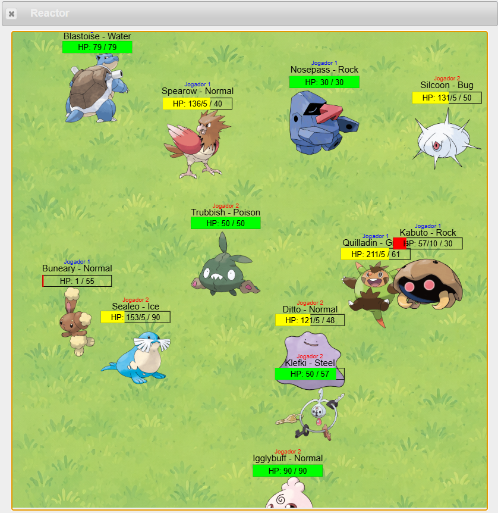

# Laboratório 6

## 🎯 Contexto e Objetivos

Neste laboratório, vamos construir um **jogo de batalha entre Pokémon**!



<br>

O jogo acontece em um cenário onde os Pokémon de cada time se movem livremente. Quando dois Pokémon de times adversários colidem, eles se atacam, causando dano uns aos outros. 
O jogo acaba quando algum dos jogadores não tem mais Pokémon vivos.

Primeiro, vamos modelar a disputa entre dois Pokémon. Depois, vamos expandir a solução para trabalhar com dois **times de Pokémon**.

<br>

Este laboratório usa a biblioteca de Pokémon do Lab 6, importada com:

```
include url("https://lucasalegre.github.io/pensamento-computacional/src/data/labs/pokemon-lib6.arr")
```

Leia o arquivo `pokemon-lib6.arr` (ao final desta página) para entender os tipos, funções e constantes já disponíveis.

> 💡 **INSTRUÇÕES PARA O LABORATÓRIO:**
> - Siga as dicas de estilo de código do Pyret: https://lucasalegre.github.io/pensamento-computacional/topics/style-guide
> - Use os nomes de funções e dados (`data`) definidos nas questões.
> - DEVE ser colocada a documentação completa, ou seja, contrato, objetivo, e pelo menos 2 exemplos/testes (cláusula `where:`). Só não precisa incluir testes nas funções que geram imagens.
> - Em todos os condicionais (`ask`, `cases`, `if`) coloque um comentário explicando cada caso.

## Template

Copie o template para o seu ambiente de desenvolvimento (code.pyret.org ou VS Code). Não esqueça de salvar o seu arquivo!

```pyret
file: src/data/labs/lab6-template.arr
```

---

## 🔍 Exercício 0: Entendendo a Base do Jogo

Neste laboratório vamos modelar um jogo de batalha em um cenário 2D. Cada Pokémon é representado por uma estrutura `Pokemon`, que tem as seguintes informações:

```
data Pokemon:
    # Estrutura para representar um Pokemon
    | pokemon(
        nome :: String,          # Nome do pokemon 
        id :: Number,            # Identificador do pokemon
        tipo :: TipoPokemon,     # Tipo do Pokémon
        x :: Number,             # Coordenada x do pokemon
        y :: Number,             # Coordenada y do pokemon
        dx :: Number,            # Deslocamento em x para a imagem do pokemon
        dy :: Number,            # Deslocamento em y para a imagem do pokemon
        speed :: Number,         # Velocidade de movimento do pokemon
        hp :: Number,            # Quantidade de pontos de vida (HP) do pokemon
        max-hp :: Number,        # Quantidade máxima de pontos de vida (HP) do pokemon
        img :: Image,            # Imagem do pokemon
        movimento :: Movimento)  # Movimento do pokemon
end
```

Veja na biblioteca como a função `extrai-pokemon-tabela :: Number, Table -> Pokemon` constrói um `Pokemon` a partir de uma linha da tabela de dados dos Pokémon atribuindo coordenadas iniciais aleatórias.

O estado do jogo é representado por uma estrutura chamada `World`, que possui como atributos os times dos dois jogadores.

Leia as definições de `Pokemon` e `World` no arquivo `pokemon-lib6.arr` para entender melhor a estrutura dos dados que serão usadas nos exercícios seguintes.

> 💡 **Não é necessário escrever código neste exercício.**

---

## ⚔️ Exercício 1: Duelo Entre Dois Pokémon

Vamos implementar a lógica básica do combate entre dois Pokémon que andam pela tela.

Nesta primeira etapa, considere um mundo com apenas 1 Pokémon de cada lado.

### Lógica do jogo (visão geral)

Em cada passo de tempo (tick):

1. Cada Pokémon se move de acordo com sua direção (`dx`, `dy`) e velocidade (`speed`).
2. Se um Pokémon encostar na borda da tela, ele inverte a direção correspondente.
3. Se os dois Pokémon colidirem, um ataca o outro e ambos invertem a direção.
4. O jogo termina quando pelo menos um lado não tiver mais Pokémon vivos.

### Funções que devem ser completadas no template

1. `aplica-movimento(p :: Pokemon, m :: Movimento) -> Pokemon`
Objetivo: aplicar ataque ou cura sobre o Pokémon `p`.
No caso de ataque, use o efeito de tipo (`verifica-efeito`) e converta para multiplicador (`efeito-to-multiplicador`) antes de atualizar HP.

2. `ataque-pokemon(p-atacante :: Pokemon, p-defensor :: Pokemon) -> Pokemon`
Objetivo: aplicar no defensor o movimento do atacante.

3. `inverte-direcao(p :: Pokemon) -> Pokemon`
Objetivo: inverter `dx` e `dy` (multiplicar ambos por `-1`).

4. `move-pokemon(p :: Pokemon) -> Pokemon`
Objetivo: atualizar posição (`x`, `y`) com base em direção e velocidade.
Ao ultrapassar limites do cenário (`LARG` e `ALT`), inverta só a componente da direção que bateu na borda.

5. `colidiu(p1 :: Pokemon, p2 :: Pokemon) -> Boolean`
Objetivo: detectar se dois Pokémon se sobrepõem.
Use distância euclidiana entre as coordenadas dos Pokémon para determinar colisão:

    `dist = sqrt((x1 - x2)^2 + (y1 - y2)^2)`

    Há colisão quando `dist <= r1 + r2`, onde `r1` e `r2` podem ser aproximados por metade da largura das imagens (`image-width(img) / 2`).

6. `esta-vivo(p :: Pokemon) -> Boolean`
Objetivo: verificar se o HP é maior que zero.

7. `acabou-jogo(w :: World) -> Boolean`
Objetivo: verificar se algum lado ficou sem Pokémon vivos.

8. `desenha-mundo(w :: World) -> Image`
Objetivo: desenhar o estado atual do jogo na tela.

9. `atualiza-mundo(w :: World) -> World`
Objetivo: produzir o próximo estado do jogo aplicando movimento e ataques.

10.  `gera-video(w :: World) -> List<Image>`
Objetivo: gerar recursivamente a sequência de frames do jogo até o término.

**Esta é a função principal do jogo.**

---

## 🧠 Exercício 2: Argumento de Terminação

Escreva um argumento de terminação para o programa do Exercício 1, considerando a função principal `gera-video-v0`.

1. Dê um argumento de terminação para a função `gera-video-v0`, assumindo que o valor do argumento `max-frames` seja positivo:

2. Dê um argumento de terminação para a função `gera-video-v0`, assumindo que o valor do argumento `max-frames` seja negativo. 
Considere na sua resposta: existe um caso base para a recursão? Que premissas são necessárias para garantir que o caso base será atingido eventualmente?

---

## 👥 Exercício 3: Times de Pokémon

Agora vamos generalizar o duelo para trabalhar com **times** de Pokémon.

Complete as funções abaixo no template para suportar múltiplos Pokémon por jogador:

1. `desenha-time(t :: Time, cena :: Image, nome-time :: String) -> Image`
Objetivo: desenhar todos os Pokémon de um time na cena.

1. `processa-ataque(p :: Pokemon, time-inimigo :: Time) -> Pokemon`
Objetivo: processar o ataque que `p` sofre de um time inimigo.
Percorre o time inimigo até achar o primeiro Pokémon que colide com `p`; quando colidir, aplica o ataque e inverte a direção.

1. `processa-ataques(time1 :: Time, time2 :: Time) -> Time`
Objetivo: atualizar cada Pokémon de `time1` recebendo ataques de `time2`.

1. `atualiza-mundo(w :: World) -> World`
Objetivo: atualizar os dois times em um frame.
Ela deve:
- Mover os pokemon dos dois times;
- Processar ataques dos dois lados;
- Filtrar os Pokémon sem vida com `filter(esta-vivo, ...)`.

1. `gera-video(w :: World) -> List<Image>`
Objetivo: Manter a geração recursiva dos frames, agora com times.

---

## ♾️ Exercício 4: Terminação com Times

Atualize o argumento de terminação do Exercício 2 para o programa com times. Explique por que o programa continua terminando quando cada jogador possui uma lista finita de Pokémon.

> **Dica:** Pense na quantidade de pontos de vida restante ou na quantidade de Pokémon vivos no mundo. Especifique o papel da filtragem dos Pokémon sem vida no caso de parada.

---

## Exercício 5: Custo de Execução

1. Analise a complexidade assintótica de `atualiza-mundo(w :: World)`, em função do tamanho dos times de entrada (N).

2. Considere o custo das funções auxiliares chamadas por `atualiza-mundo`, como movimentação, detecção de colisão e processamento de ataques.

3. Escreva o resultado final em notação assintótica (big O), explicando em uma frase curta o raciocínio usado.

---

## Desafios Bônus:

Neste lab, cada Pokemon é inicializado com um movimento de ataque na função `extrai-pokemon-tabela`. 
Adapte o jogo para tratar colisões entre Pokémon do mesmo time: quando dois Pokémon do mesmo time colidirem, eles podem se curar caso possuam um movimento de cura.

## pokemon-lib6.arr

Biblioteca de Pokémon importada para o Laboratório 6.

```pyret
file: src/data/labs/pokemon-lib6.arr
```
