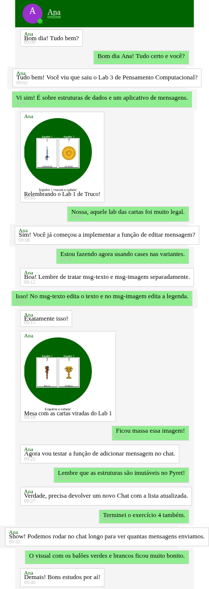

# Laboratório 3: Aplicativo de Mensagens

## 🎯 Contexto e Objetivos

Neste laboratório, vamos colocar em prática os conceitos de **estruturas de dados**, **dados condicionais** e **recursão sobre listas de estruturas**, modelando um aplicativo de mensagens.

<br>



<br>

Em um aplicativo de mensagens, trabalhamos com três entidades principais:
- **`Usuario`**: representa um usuário ou contato, contendo seu nome, avatar (imagem de perfil) e status (*online* ou *offline*);
- **`Mensagem`**: representa um envio no chat, podendo ser de duas formas distintas — uma mensagem de **texto puro** (`msg-texto`) ou uma mensagem contendo uma **imagem com legenda** (`msg-imagem`);
- **`Chat`**: representa a conversa ativa, agrupando o contato com quem conversamos e a lista de mensagens trocadas.

<br>

O template já traz um chat pré-carregado na constante `CHAT-LONGO`, que você poderá usar para verificar o funcionamento das funções que você implementar.


> 💡 **INSTRUÇÕES PARA O LABORATÓRIO:**
> - Siga as dicas de estilo de código do Pyret: https://lucasalegre.github.io/pensamento-computacional/topics/style-guide
> - Use exatamente os nomes de tipos (`data`), variantes e funções definidos nos enunciados.
> - Todas as funções devem conter documentação completa: **contrato de tipos**, string de objetivo (`doc:`) e pelo menos **2 exemplos/testes** na cláusula `where:` (só não é obrigatório incluir testes nas funções que geram imagens).
> - Em todas as cláusulas condicionais (`ask`, `cases`, `if`), inclua um comentário explicando cada caso.

---

## Template

Copie o template para o seu ambiente de desenvolvimento (code.pyret.org ou VS Code). Não esqueça de salvar o seu arquivo!

```pyret
file: src/data/labs/2026-2/lab3-template.arr
```

---

## 👤 Exercício 1: Modelando Usuários, Mensagens e Chat

### 1.1 Definição das Estruturas de Dados

1. Defina o tipo de dado `Usuario` com três campos:
   - `nome`: o nome do contato (ex: `"Ana"`, `"Eu"`);
   - `avatar`: a imagem do perfil do usuário; Dica: você pode usar a função `avatar-contato` da biblioteca para criar avatares simples;
   - `online`: indica se o usuário está online (`true`) ou offline (`false`).

2. Defina o tipo de dado `Mensagem` com duas variantes:
   - `msg-texto`:
     - `autor`: o nome de quem enviou;
     - `horario`: o horário do envio (ex: `"09:00"`);
     - `texto`: o texto da mensagem.
   - `msg-imagem`:
     - `autor`: o nome de quem enviou;
     - `horario`: o horário do envio;
     - `imagem`: a imagem enviada;
     - `legenda`: a legenda descritiva da imagem.

3. Defina o tipo de dado `Chat` com dois campos:
   - `contato` (`Usuario`): o contato da conversa;
   - `mensagens` (`List<Mensagem>`): a lista com o histórico de mensagens trocadas.

### 1.2 Criação Manual de Constantes de Teste

Crie manualmente instâncias dessas estruturas para usar como dados de teste nos próximos exercícios:
- Pelo menos 2 contatos. Você pode usar a função `avatar-contato` da biblioteca para criar avatares simples.
- Pelo menos 3 mensagens, sendo uma do tipo imagem.
- 1 chat inicial: `CHAT-TESTE`, reunindo um contato e a lista com essas 3 mensagens.

> ℹ️ **Chat Longo Pré-Carregado:** No template, logo abaixo do Exercício 1, já é fornecido o código que lê uma tabela de mensagens e cria a constante `CHAT-LONGO`. Assim que você definir suas estruturas, essa constante ficará pronta para você usar e explorar nos próximos exercícios.

---

## ✏️ Exercício 2: Editando uma Mensagem

Em aplicativos de mensagens, podemos editar mensagens já enviadas. Em linguagens funcionais, dados são **imutáveis**: em vez de alterar o objeto original, geramos uma nova mensagem com o conteúdo atualizado.

Implemente a função `edita-mensagem`:

Dada uma mensagem `m` e uma `String` com o `novo-texto`:
- Se for `msg-texto`: devolve uma nova `msg-texto` mantendo o mesmo autor e horário, mas com o campo `texto` atualizado para `novo-texto`;
- Se for `msg-imagem`: devolve uma nova `msg-imagem` mantendo autor, horário e imagem, mas com o campo `legenda` atualizado para `novo-texto`.

> 💡 **Dica:** Utilize a expressão `cases (Mensagem) m:` para tratar cada variante separadamente.
> 📝 Adicione pelo menos 2 testes na cláusula `where:`.

---

## ➕ Exercício 3: Adicionando uma Mensagem em um Chat

Quando uma nova mensagem é enviada, ela é adicionada ao final da lista de mensagens da conversa.

1. Implemente a função auxiliar recursiva `adiciona-no-fim`, que, dada uma lista de mensagens e uma nova mensagem, devolve uma nova lista com a mensagem adicionada ao final.

2. Implemente a função `adiciona-mensagem`: Dado um chat `c` e uma nova mensagem `m`, devolve um novo `Chat` com o mesmo contato e a mensagem adicionada ao final da sua lista de mensagens.

> 📝 Preencha a cláusula `where:` de ambas as funções usando suas constantes manuais criadas no Exercício 1.

---

## ✍️ Exercício 4: Editando uma Mensagem do Chat

No Exercício 2, você editou uma mensagem isolada. Agora vamos editar uma mensagem que já está no histórico de um chat. Para identificar qual mensagem deve ser editada, vamos usar o seu **horário** de envio (considere que não há duas mensagens com o mesmo horário no chat).

1. Implemente a função auxiliar `edita-por-horario`: Dada uma lista de mensagens, um horário (`String`) e um novo texto (`String`), devolve uma nova lista de mensagens em que a mensagem enviada naquele horário teve seu texto (ou legenda, se for uma imagem) trocado por `novo-texto`. Caso não exista nenhuma mensagem com aquele horário, devolve a lista original.

2. Implemente a função `edita-chat`: Dado um chat `c`, um horário e um novo texto, devolve um novo `Chat` com o mesmo contato e com o histórico em que a mensagem enviada naquele horário teve seu texto (ou legenda, se for uma imagem) trocado por `novo-texto`.

> 📝 Adicione testes na cláusula `where:` usando suas constantes manuais. Não esqueça de testar um horário que não existe no chat!
> 🚀 **Experimente no Chat Longo:** Execute no painel de interações chamadas como `edita-chat(CHAT-LONGO, "09:01", "Bom dia Ana! Tudo ótimo e você?")` (mensagem de texto) e `edita-chat(CHAT-LONGO, "09:05", "Saudades do Lab 1 de Truco!")` (mensagem com imagem) e confira que apenas a mensagem daquele horário mudou!

---

## 🖼️ Exercício 5: Desenhando um Chat

Neste exercício, vamos transformar nossa estrutura de dados em uma interface visual de chat parecida com os aplicativos que usamos no celular.

Sua tarefa consiste em implementar duas funções:

1. Implemente a função recursiva `desenha-mensagens`:
   ```
   desenha-mensagens(mensagens :: List<Mensagem>) -> Image
   ```
   Dada uma lista de mensagens, empilha todas as imagens dos balões verticalmente.

2. Implemente a função `desenha-chat`:
   ```
   desenha-chat(c :: Chat) -> Image
   ```
   Dado um `Chat`, desenha o cabeçalho com o avatar e nome do contato, seguido abaixo da lista de mensagens desenhadas.

Ao finalizar, descomente e execute as chamadas no painel de interações:
```
desenha-chat(CHAT-TESTE)
desenha-chat(CHAT-LONGO)
desenha-chat(edita-chat(CHAT-LONGO, "09:05", "Saudades do Lab 1 de Truco!"))
```

---

## chat-lib3.arr

Biblioteca de suporte para o Laboratório 3.

```pyret
file: src/data/labs/chat-lib3.arr
```
