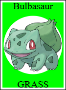
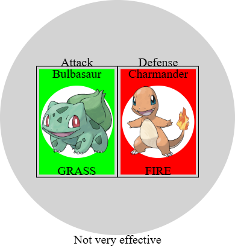
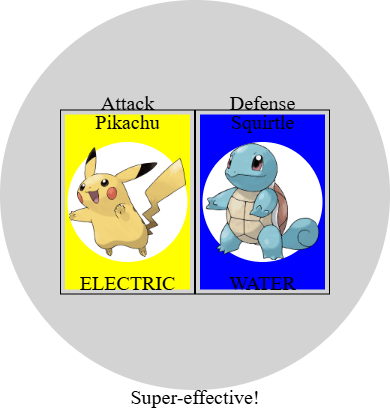

# Laboratório 1

## 🎯 Contexto e Objetivos

Neste laboratório, vamos praticar os conceitos de projeto de algoritmos vistos em aula, assim como a criação de funções com **condicionais** (`ask`), **composição de funções** que operam sobre imagens, e o uso de **constantes**.

<br>

O tema deste laboratório é o universo de [Pokémon](https://pt.wikipedia.org/wiki/Pok%C3%A9mon)!  Pokémon™ é um jogo muito popular no qual criaturas batalham. Um dos muitos atributos que um Pokémon™ pode ter é um tipo. Atualmente existem 18 tipos diferentes, como normal, fire 🔥, water 💧, grass 🌿, etc. Por simplicidade, vamos considerar neste projeto que cada Pokémon™ pode ter um único tipo. Estes tipos conferem certas vantagens ou desvantagens num duelo. Por exemplo, um ataque do tipo fire terá efetividade normal contra um Pokémon™ do tipo electric, efetividade aumentada contra um Pokémon™ do tipo ice e efetividade reduzida contra um Pokémon™ do tipo water. Algumas combinações também podem não ter efeito algum, como por exemplo um ataque do tipo ground contra um Pokémon™ do tipo flying.

Sua missão é **construir visualmente as cartas** de diferentes Pokémon e **simular o resultado de um ataque** através de lógica de programação.

> 💡 **INSTRUÇÕES PARA O LABORATÓRIO:**
> - Siga as dicas de estilo de código do Pyret: https://lucasalegre.github.io/pensamento-computacional/topics/style-guide 
> - Use os nomes de funções definidos nas questões.
> - DEVE ser colocada a documentação completa, ou seja, contrato, objetivo, e pelo menos 2 exemplos/testes (só não precisa incluir testes nas funções que geram imagens).
> - Nas funções que geram imagens, deixe apenas as chamadas para que quando seu arquivo for executado, as imagens sejam geradas.
> - Você pode consultar funções úteis sobre Imagens em [Tipos de Dados](https://lucasalegre.github.io/pensamento-computacional/topics/tipos-de-dados) ou na [documentação do Pyret](https://pyret.org/docs/latest/image.html).
> - Em todos os condicionais, explique cada caso com um comentário.

## Template

Copie o template para o seu ambiente de desenvolvimento (code.pyret.org ou VS Code). Não esqueça de salvar o seu arquivo!

```pyret
file: src/data/labs/lab1-template.arr
```

## 🛠️ Exercício 1: Constantes de Texto

**Constantes** são nomes que damos para valores. Podemos definir constantes de qualquer tipo e devemos escolher nomes significativos para as constantes. Duas das grandes vantagens de usarmos constantes são: (i) tornar o código mais *legível*, pois usamos uma palavra para representar um valor; (ii) tornar o código mais *fácil de alterar*, pois se quisermos mudar o valor associado à esta constante é necessário apenas alterar o valor no lugar onde a constante foi definida (ao invés de procurar em todo o código os locais onde um determinado valor foi usado).

O bom uso de constantes faz com que menos erros sejam cometidos.

Defina as seguintes constantes (que serão usadas mais para frente):

| Nome da Constante | Valor Exato (String) |
| :--- | :--- |
| `ATAQUE` | `"Attack"` |
| `DEFESA` | `"Defense"` |
| `EFEITO-NAOEFETIVO` | `"Not very effective"` |
| `EFEITO-EFETIVO` | `"Effective"` |
| `EFEITO-SUPEREFETIVO` | `"Super-effective!"` |

Além destas, defina as **constantes dos tipos de Pokémon**: `TYPE-NORMAL`, `TYPE-FIRE`, `TYPE-WATER`, `TYPE-ELECTRIC` e `TYPE-GRASS`. O valor atribuído a cada uma deve ser uma _string_ com o seu próprio nome em maiúsculas (ex: `"FIRE"` ou `"GRASS"`).

---

## 🎨 Exercício 2: Constantes de Imagem

Usando as conhecidas funções gráficas do Pyret (`rectangle`, `circle`, etc.), defina as **constantes visuais** que formarão nossas cartas e o campo de batalha. Preste atenção nas dimensões indicadas.

- **Dimensões das Cartas:** `CARTA-ALT = 175` e `CARTA-LAR = 125` *(elas já devem estar no topo do seu template!)*.
- **Fundos de cada tipo:** Defina retângulos **sólidos** (`"solid"`) das dimensões base acima. Use cores que representem cada tipo de Pokémon (e.g., verde para grama, azul para água).

As cores em Pyret podem ser consultadas aqui: https://pyret.org/docs/latest/color.html#%28part._s~3acolor-constants%29

- **Componentes visuais da batalha:**
  - `MESA`: O local do duelo. Será um círculo `"solid"` e cinza claro (`"lightgray"`). O *raio* deve ser `20 + CARTA-ALT`.
  - `BORDA`: A fita de baralho da carta. Será um retângulo sem preenchimento (`"outline"`) na cor preta (`"black"`). Ele deve ser **um pouco maior** que o tamanho base da carta. Faça com que a largura seja `CARTA-LAR + 10` e a altura seja `CARTA-ALT + 10`.

> ⚠️ **ATENÇÃO:** Algumas variáveis contendo imagens de Pokémon extraídas da internet já foram providenciadas no topo do seu template (`BULBASAUR-IMG`, `SQUIRTLE-IMG`, etc.). Use esses *sprites* estilizados para seus Pokémons!

---

## 🔍 Exercício 3: Selecionando os Elementos das Cartas

Vamos agora dar movimento condicional ao jogo! Crie duas funções utilizando a super-estrutura lógica `ask` para selecionar o fundo e as imagens nas cartas:

1. **A função `seleciona-fundo`**: tem 1 argumento, uma `String` (o **tipo**). Ela deve devolver a **constante de imagem de fundo** correta. 
   - *Exemplo:* se o `tipo` passado for igual a `TYPE-FIRE`, retorne a imagem em `FUNDO-FIRE`.

2. **A função `seleciona-imagem-pokemon`**: tem 1 argumento, uma `String` (o **nome do Pokémon**). Ela deve devolver a respectiva imagem (`BULBASAUR-IMG`, etc.). Cubra as strings `"Bulbasaur"`, `"Charmander"`, `"Squirtle"` e `"Pikachu"`.

> 📝 **LEMBRETE SOBRE OS TESTES!**
> Nunca deixe as cláusulas `where:` vazias! Preencha-as testando o que a função deve retornar. 
> Ex: `seleciona-fundo(TYPE-FIRE) is FUNDO-FIRE`

---

## 🖼️ Exercício 4: Montagem da Carta

Vamos utilizar as funções de composição de imagem do Pyret (`overlay` e `overlay-align`) para montar nossas cartas!

Implemente a função `cria-carta` recebendo dois parâmetros (ambos `String`): o **nome** e o **tipo** respectivo. Ela deve devolver a `Image` pronta da carta.

> 🛠️ **Dica de Funções:**
> Você precisará usar as funções de composição de imagem do Pyret para colocar os elementos uns sobre os outros!
> - `overlay(img1 :: Image, img2 :: Image) -> Image`: Para colocar uma imagem centralizada **em cima** de outra.
> - `overlay-align(x :: String, y :: String, img1 :: Image, img2 :: Image) -> Image`: Para alinhar objetos! Ex: `overlay-align("middle", "bottom", texto, fundo)`.
> - Utilize a sua função `seleciona-fundo` para buscar a base e `seleciona-imagem-pokemon` para buscar o lutador.
> - Lembre-se que a nossa `BORDA` (definida no Exercício 2) tem que ficar por baixo para dar o acabamento em volta da carta toda!

*Devolva a imagem composta! Descomente e admire o seu resultado rodando `cria-carta("Bulbasaur", "GRASS")`!*

A sua carta formatada deverá se parecer com o exemplo abaixo:



---

## ⚔️ Exercício 5: Vantagens e Efeitos

Em uma batalha Pokemon, certos elementos tem vantagem sobre outros! Desenvolva a função lógica chamada de `verifica-efeito` com os parâmetros `tipo-ataque` e `tipo-defesa` (ambas Strings). Ela avalia e **retorna a constante correta do efeito da briga** (`EFEITO-NAOEFETIVO`, `EFEITO-EFETIVO` ou `EFEITO-SUPEREFETIVO`).

Siga precisamente as diretrizes das Vantagens (*Ataque atinge -> Defesa*):

| Atacante | Fraqueza (Super Efetivo) | Resistência (Não Efetivo) |
| :---: | :--- | :--- |
| 🔥 **FIRE** | `GRASS` | `WATER` ou `FIRE` |
| 💧 **WATER** | `FIRE` | `GRASS` ou `WATER` |
| ⚡ **ELECTRIC**| `WATER` | `GRASS` ou `ELECTRIC` |
| 🌿 **GRASS** | `WATER` | `FIRE` ou `GRASS` |

*Para TODAS as outras permutações, considere apenas o genérico **Efeito Efetivo**.*

> 🧠 **DICA PARA OS CASOS ASK:** 
> Teste primeiro "se o atacante for de fogo". Daí, **dentro desse bloco**, abra *outro ask* pra testar quem é o defensor! Fazer "ask aninhados" deixa o código mais limpo!

> Tabela de vantagens de tipos de Pokemon: https://pokemondb.net/type
---

## 💥 Exercício 6: Batalha Final

Agora vamos montar o cenário da batalha! Crie a função `desenha-cenario` da seguinte forma:

**Entrada:** 
1. Nome do Pokémon atacante
2. Tipo do Pokémon atacante
3. Nome do Pokémon defensor
4. Tipo do Pokémon defensor

> 🛠️ **Dica de Funções:**
> Novamente, use as funções gráficas a seu favor para alinhar os objetos como na imagem de exemplo abaixo!
> - `above(img1, img2)`: Coloca a primeira imagem exatamente acima da segunda (Ideal para colocar os letreiros com os textos da constante `ATAQUE` em cima da carta atacante, além do texto final embaixo da mesa toda).
> - `beside(img1, img2)`: Coloca a primeira imagem lado a lado à esquerda da segunda. Aproveite para montar as duas cartas em modo duelo!
> - `overlay-align(x, y, img1, img2)`: Será essencial para você assentar a dupla lado a lado exatamente no centro da imagem da nossa `MESA`.

Seu cenário final deverá se parecer com isso:



